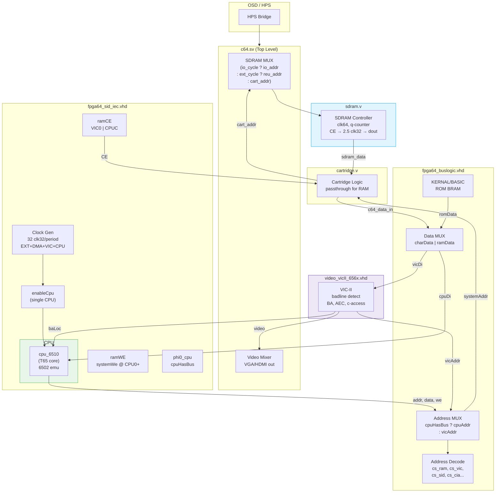
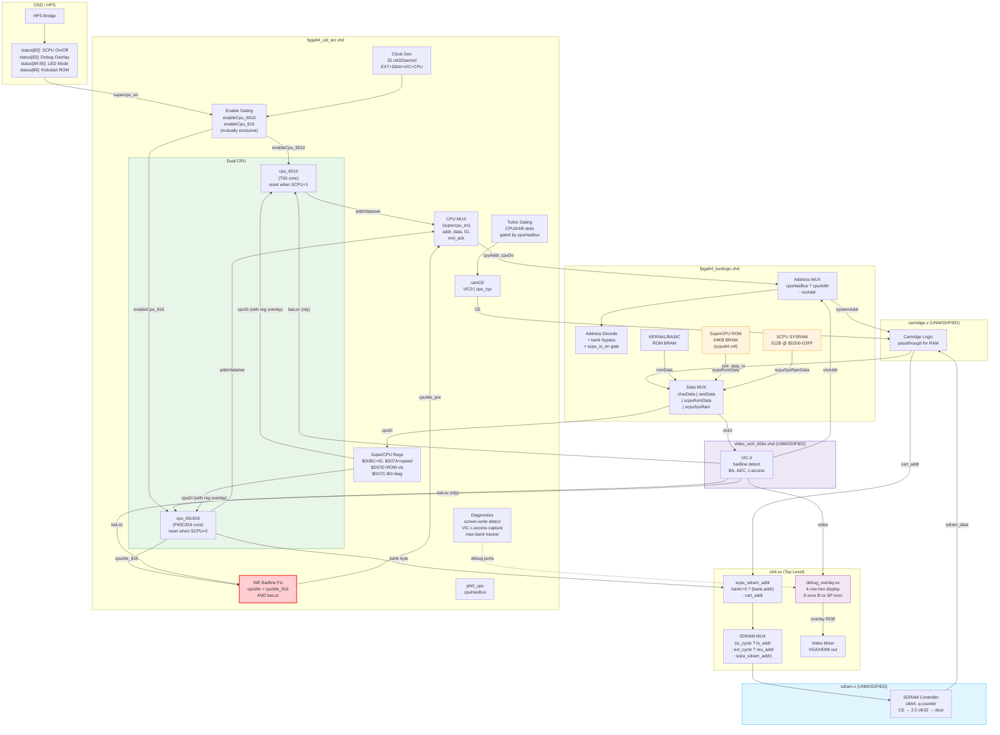
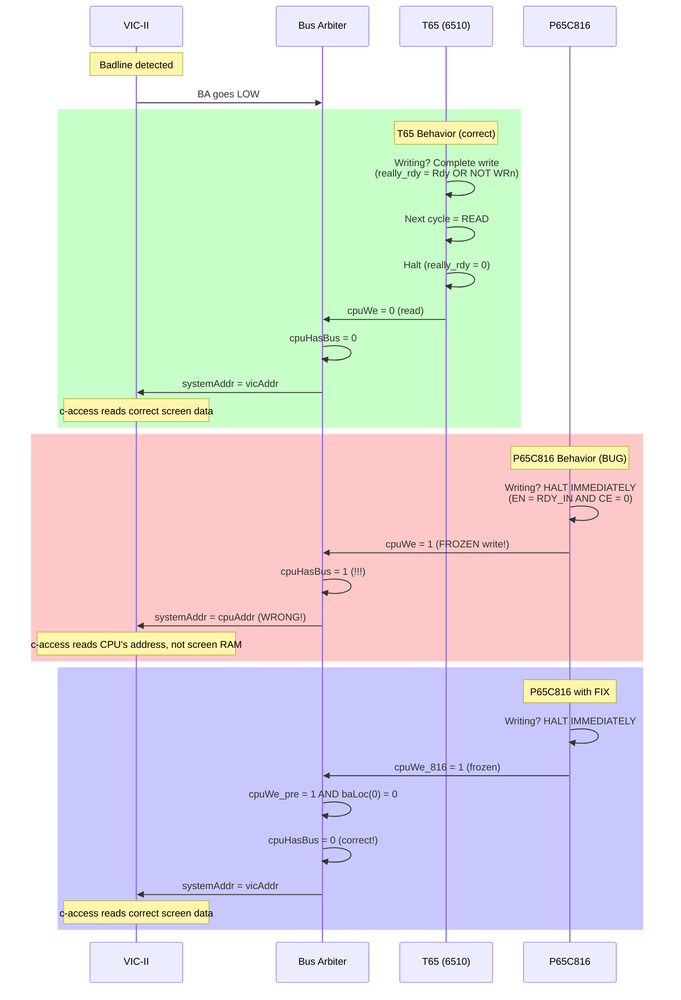

# Changes vs. Upstream MiSTer C64 Core

**Baseline:** Official MiSTer C64 core ([MiSTer-devel/C64_MiSTer](https://github.com/MiSTer-devel/C64_MiSTer))
**Current:** SuperCPU integration (commit `93aa4e3`)

---

## Architecture Overview

### Before: Stock MiSTer C64



### After: SuperCPU Integration



---

## File-by-File Change List

### Modified Files (4 RTL + 2 build)

#### 1. `c64.sv` — Top-Level MiSTer Module

| # | Change | Reason |
|---|--------|--------|
| 1 | OSD menu: `status[82]` SuperCPU toggle, `[83]` debug overlay, `[84:85]` LED mode, `[86]` kickstart ROM | User interface for SuperCPU enable and debug features |
| 2 | LED_USER MUX: 4 modes (normal, emulation, CPU active, CPU write) | Board LED debug probe to visualize CPU state |
| 3 | SDRAM address: `cart_addr` → `scpu_sdram_addr` in non-io/ext path | 24-bit SDRAM addressing for 16MB SuperRAM (banks $01-$FF) |
| 4 | `scpu_sdram_addr`: `{1'b0, bank, addr}` when bank != $00, else `cart_addr` | Map 65C816 bank byte to SDRAM address space |
| 5 | ~30 debug wire declarations and port connections to fpga64_sid_iec | Route debug signals (CPU state, screen-write detect, VIC capture) to overlay |
| 6 | `debug_overlay` instantiation + video path overlay MUX | Renders hex debug display in top border; toggled by OSD |

#### 2. `fpga64_sid_iec.vhd` — Main System / Bus Arbitration

| # | Change | Reason |
|---|--------|--------|
| 1 | ~40 new entity ports (SuperCPU control + debug outputs) | Interface for SuperCPU enable, bank, emulation status, and debug export |
| 2 | Dual CPU instantiation: `cpu_6510_inst` + `cpu_816_inst` | Two CPU cores, only one active at a time via `supercpu_en` |
| 3 | Enable gating: `enableCpu_6510`/`enableCpu_816` (mutually exclusive) | Prevent bus contention — inactive CPU receives no clock enables |
| 4 | Reset gating: inactive CPU held in reset (`reset or supercpu_en`/`not`) | Clean state for inactive CPU |
| 5 | CPU MUX: addr/data/we/IO/nmi_ack selected by `supercpu_en` | Route active CPU's outputs to system bus |
| 6 | **WE badline fix:** `cpuWe_pre <= (cpuWe_816 and baLoc)` | **Root cause fix.** P65C816 freezes mid-write during badline (unlike T65 which completes writes). Frozen WE='1' tricks `cpuHasBus` into granting bus → VIC reads wrong address. Gating with `baLoc` forces WE='0' when BA is low. |
| 7 | Turbo slots gated: `cpuHasBus = '1'` added to CPU0/CPU4/CPU8 | Prevent wasted SDRAM reads during badlines (CPU is halted, turbo is wasted) |
| 8 | `supercpu_cycle` signal | Tells `c64.sv` when to use banked SDRAM addressing (only during CPU RAM bus ownership) |
| 9 | SuperCPU register overlay on `cpuDi` ($D0BC, $D0B0, $D07A, etc.) | Emulate SuperCPU hardware identification and control registers |
| 10 | `$D07E` ROM-visibility register | Controls SuperCPU kickstart ROM vs C64 KERNAL at $E000-$FFFF |
| 11 | `$D07A` speed register | Bit 5: force 1MHz compatibility mode |
| 12 | Turbo mode integration for SuperCPU | Auto-enable turbo when `turbo_state='1'` and OSD turbo is on |
| 13 | Hold register logic (declared but **disabled**) | Attempted SDRAM timing fix; injected wrong data (ZP instead of screen). Disabled. |
| 14 | Early CE at CPU8 (declared but **disabled**) | Attempted early SDRAM read; returned ZP data. Disabled. |
| 15 | Screen-RAM write detector (latches writes to $0400-$07FF) | Debug: proved CPU was NOT writing $00 to screen RAM during artifact |
| 16 | VIC c-access capture pipeline (detects $00 reads during badlines) | Debug: confirmed VIC was receiving $00 from SDRAM during c-access |
| 17 | Max-bank tracker (highest PBR ever seen) | Debug: verified CPU successfully enters non-$00 banks (kickstart ROM) |
| 18 | Diagnostic counters at $D07C-$D080 | Debug: hold register fire/mismatch/zero counts readable via PEEK |

#### 3. `fpga64_buslogic.vhd` — Bus Logic / Address Decode

| # | Change | Reason |
|---|--------|--------|
| 1 | New ports: `supercpu_en`, `supercpu_rom`, `supercpu_rom_vis`, `supercpu_bank` | Receive SuperCPU state for address decode |
| 2 | SuperCPU ROM BRAM (64KB `scpu64.mif`) | Kickstart ROM for SIMM detect and KERNAL handoff at boot |
| 3 | `romData` MUX: serve SCPU ROM when visible, else KERNAL | ROM visibility switch: kickstart boots, then reveals C64 KERNAL |
| 4 | `scpu_rom_en`: banks $F0-$FF + bank $00 $8000-$9FFF during boot | SuperCPU ROM mapping across ROM banks |
| 5 | SYSRAM: 512B BRAM at $D200-$D3FF with reset sweep | Prevent kickstart writes to system RAM from corrupting VIC registers |
| 6 | `scpu_io_en` gate: I/O only accessible from bank $00 | Prevent MVN block moves through $D000-$DFFF in banks $01+ from corrupting hardware registers |
| 7 | Non-$00 bank address bypass: force `cs_ramLoc`, skip C64 decode | Banks $01-$FF are flat SuperRAM with no C64 ROM/IO overlay |
| 8 | I/O chip-select gating: all `cs_*` outputs ANDed with `scpu_io_en` | Enforce I/O isolation for non-$00 banks |
| 9 | VIC address path: unconditional `vicAddr` when `cpuHasBus='0'` | Fix: original code could fall through to `cpuAddr` when `aec='0'` |

#### 4. `C64.qsf` / `files.qip` — Build Configuration

| # | Change | Reason |
|---|--------|--------|
| 1 | Added `rtl/65C816/65C816.qip` to `files.qip` | Include P65C816 core in synthesis |
| 2 | Added `rtl/cpu_65c816.vhd` to `files.qip` | Include 65C816 wrapper in synthesis |
| 3 | Added `rtl/debug_overlay.sv` to `files.qip` and `C64.qsf` | Include debug overlay in synthesis |
| 4 | SignalTap enabled in `C64.qsf` | Real-time FPGA signal capture for hardware debugging |

### New Files (11 RTL + ROM + build scripts)

| File | Lines | Purpose |
|------|-------|---------|
| `rtl/65C816/P65C816.vhd` | 669 | 65C816 CPU core (from SNES MiSTer) + 2 C64-specific fixes |
| `rtl/65C816/MCode.vhd` | 2377 | Microcode ROM — instruction decode/sequencing |
| `rtl/65C816/AddrGen.vhd` | 229 | Address generation unit |
| `rtl/65C816/ALU.vhd` | 185 | Arithmetic Logic Unit |
| `rtl/65C816/BCDAdder.vhd` | 132 | BCD adder for decimal mode |
| `rtl/65C816/AddSubBCD.vhd` | 86 | BCD add/subtract wrapper |
| `rtl/65C816/P65816_pkg.vhd` | 57 | Types and constants package |
| `rtl/65C816/65C816.qip` | 7 | Quartus include file for core |
| `rtl/cpu_65c816.vhd` | 165 | 6510-compatible wrapper for P65C816 |
| `rtl/debug_overlay.sv` | 473 | On-screen hex debug display (SystemVerilog) |
| `rtl/roms/scpu64.mif` | 65,544 | 64KB SuperCPU kickstart ROM data |

### Unmodified Files (confirmed)

These key upstream files are **completely unchanged**:
- `rtl/sdram.v` — SDRAM controller
- `rtl/video_vicII_656x.vhd` — VIC-II
- `rtl/cpu_6510.vhd` — T65 wrapper
- `rtl/cartridge.v` — Cartridge logic
- `sys/*` — MiSTer framework (read-only by project rule)

---

## P65C816 Core Modifications (vs. stock SNES MiSTer)

Only `P65C816.vhd` has C64-specific changes. All other core files are stock SNES.

| Fix | Line | What | Why |
|-----|------|------|-----|
| IRQ B-flag | 469 | Clear bit 4 of pushed P for hardware IRQ/NMI in emulation mode | 6502 convention: B=0 for hardware interrupts, B=1 for BRK. Without this, KERNAL treats hardware IRQs as BRK instructions. |
| XCE D-reset | 430 | Clear Direct Page register D to $0000 on XCE to emulation mode | Non-zero D corrupts zero-page addressing in emulation mode, causing wrong memory access patterns. |

---

## Key Bug Fix: cpuWe Badline Gating (H31)

The most critical single change — one line that fixed the display artifact:

```vhdl
-- BEFORE (line 1014 equivalent):
cpuWe_pre <= cpuWe_816 when supercpu_en = '1' else cpuWe_6510;

-- AFTER:
cpuWe_pre <= (cpuWe_816 and baLoc) when supercpu_en = '1' else cpuWe_6510;
```

**Root cause:** The P65C816 halts immediately when RDY goes low (EN = RDY_IN AND CE),
even during write cycles. The T65 completes writes first (really_rdy = Rdy OR NOT WRn_i).
When the P65C816 freezes mid-write, its WE='1' output tricks `cpuHasBus` into granting
the bus during badlines, causing `systemAddr = cpuAddr` instead of `vicAddr`. The VIC
then reads wrong data during c-access.



---

## Change Statistics

| Category | Files Modified | Files Added | Lines Changed |
|----------|---------------|-------------|---------------|
| SuperCPU Integration | 3 | 10 | ~1,500 |
| Bus Arbitration Fixes | 2 | 0 | ~30 |
| Debug Infrastructure | 2 | 1 | ~600 |
| Build Configuration | 2 | 0 | ~200 |
| Documentation | 2 | 5+ | ~1,000 |
| **Total** | **4 RTL** | **11 RTL** | **~3,300** |
