# MiSTer C64 SuperCPU Architecture Diagrams

This document contains Mermaid architecture diagrams covering the original MiSTer C64 core,
the current SuperCPU implementation, the Ultimate 64 reference, and the planned target architecture.

---

## 1. Original MiSTer C64 Core (Before Modifications)

The unmodified MiSTer C64 core uses a single T65 (6510) CPU with all memory access routed
through SDRAM. The 32MHz system clock is divided into a 32-slot bus rotation that allocates
time between external devices, DMA, VIC-II video, and the CPU.

### 1.1 System Block Diagram

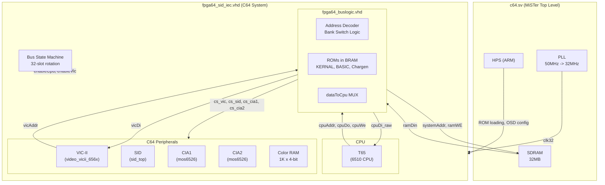

### 1.2 Bus Rotation (32 Slots per 1MHz Period)

The system clock is 32MHz. Each 1MHz CPU cycle consists of 32 clock ticks divided into
four groups. SDRAM accesses are multiplexed across these slots.

```mermaid
gantt
    title 32-Slot Bus Rotation (1 MHz Period = 32 clk32 Ticks)
    dateFormat X
    axisFormat %s

    section EXT (I/O)
    EXT0-EXT3 (Cartridge/IO) : 0, 4

    section DMA
    DMA0-DMA3 (REU/DMA)      : 4, 8

    section EXT (Refresh)
    EXT4-EXT7 (SDRAM Refresh) : 8, 12

    section VIC-II
    VIC0-VIC3 (Video Fetch)   : 12, 16

    section CPU
    CPU0-CPUF (CPU Access)    : 16, 32
```

**Slot Details:**

| Slots     | Name  | Count | Purpose                                           |
|-----------|-------|-------|---------------------------------------------------|
| 0-3       | EXT   | 4     | Cartridge/IO memory access                        |
| 4-7       | DMA   | 4     | REU and DMA engine                                |
| 8-11      | EXT   | 4     | SDRAM refresh (every 4th rotation)                |
| 12-15     | VIC   | 4     | VIC-II character/bitmap/sprite fetch              |
| 16-31     | CPU   | 16    | CPU SDRAM access (1 real access at CPUC)          |

### 1.3 CPU Enable Pipeline (SDRAM Path)

The CPU enable signal is derived through a 3-stage pipeline from the bus state machine.
This ensures SDRAM data is stable before the CPU latches it.

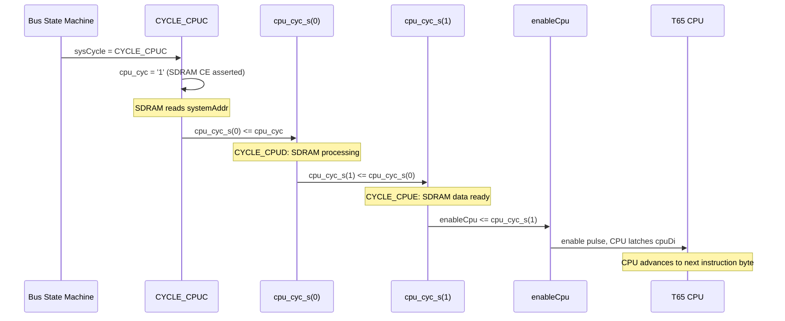

### 1.4 Original Turbo Mode

The original core supports 2x/3x/4x turbo by adding extra SDRAM access slots at
CPU0, CPU4, and CPU8. Each extra slot uses the same pipeline (2-cycle delay from
cpu_cyc to enableCpu).

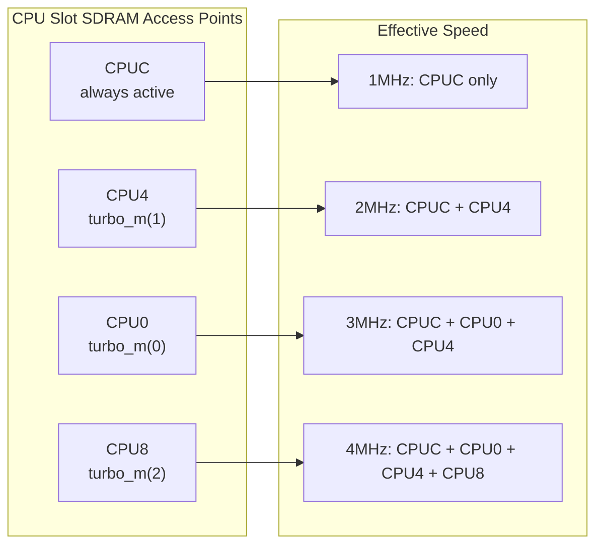

**Conditions for turbo slot activation:**
- `turbo_m(n) = '1'` (OSD-configured speed)
- `cs_ram = '1'` (RAM access, not I/O)
- `cpuHasBus = '1'` (CPU owns bus)
- `baLoc = '1'` (no VIC badline)

---

## 2. Current MiSTer C64 SuperCPU Core

The current implementation adds a dual-CPU architecture with an 8KB BRAM cache and
a 32KB dual-port BRAM for VIC zero-contention access. The P65C816 CPU enables
SuperCPU compatibility with 24-bit addressing and up to 16MB of SuperRAM via SDRAM.

### 2.1 System Block Diagram

```mermaid
flowchart TB
    subgraph MiSTer_Top["c64.sv (MiSTer Top Level)"]
        HPS["HPS (ARM)\nOSD Config"]
        SDRAM["SDRAM 32MB\nBank $00: 64K C64 RAM\nBanks $01-$EF: SuperRAM\nBank $F8: SCPU ROM shadow"]
        PLL["PLL\n50MHz -> 32MHz"]
        ADDR_MUX["SDRAM Address MUX\nscpu_sdram_addr"]
    end

    subgraph fpga64["fpga64_sid_iec.vhd (C64 SuperCPU System)"]
        subgraph DualCPU["Dual CPU (OSD Selectable)"]
            T65["T65 (6510)\ncpu_6510_inst"]
            P65["P65C816 (65C816)\ncpu_816_inst\n(cpu_65c816.vhd)"]
            MUX_CPU["CPU MUX\ncpuAddr_pre\ncpuDo_pre\ncpuWe_pre"]
        end

        subgraph Cache["8KB BRAM Cache (cpu_cache.vhd)"]
            TAGS["MLAB Tags\n1024 x 11-bit\n(combinational read)"]
            DATA["M10K Data\n1024 x 8 bytes\n(1-cycle registered read)"]
            VALID["MLAB Valid\n1024 x 8 bits\n(per-byte valid)"]
            WB["Write Buffer\n16-entry FIFO\n(currently disabled)"]
        end

        subgraph BRAM_32K["32KB Dual-Port BRAM (c64_ram64k.vhd)"]
            PORTA["Port A (CPU)\nRead/Write\n$0000-$7FFF"]
            PORTB["Port B (VIC)\nRead Only\n$0000-$7FFF"]
        end

        subgraph BusLogic["fpga64_buslogic.vhd"]
            ADDR_DEC["Address Decoder\n+ SuperCPU bank bypass"]
            ROM_BRAM["ROMs in BRAM\nKERNAL, BASIC, Chargen\n+ SuperCPU ROM (64KB)"]
            SYSRAM["SCPU System RAM\n512B at $D200-$D3FF"]
            DATA_MUX_BL["dataToCpu MUX\n(cpuDi_raw)"]
        end

        subgraph Peripherals["C64 Peripherals"]
            VIC["VIC-II"]
            SID["SID"]
            CIA1["CIA1"]
            CIA2["CIA2"]
        end

        DI_MUX["cpuDi Priority MUX\n1. bram_do (bram_hit_d1)\n2. cache_di (cache_hit_d1)\n3. SCPU registers\n4. cpuDi_raw (SDRAM path)"]
        EN_GATE["Enable Gating\nenableCpu_6510\nenableCpu_816"]
        BUS_SM["Bus State Machine\n32-slot rotation"]
        SCPU_REG["SuperCPU Registers\n$D07A-$D0BC"]
        IEC_SLOW["IEC Auto-Slowdown\nCIA2 write detection\n32ms timeout"]
    end

    PLL -->|clk32| fpga64
    T65 -->|cpuAddr/Do/We_6510| MUX_CPU
    P65 -->|cpuAddr/Do/We_816\naddr_hi_816 (bank)| MUX_CPU
    MUX_CPU -->|cpuAddr_pre| Cache
    MUX_CPU -->|cpuAddr_pre| BRAM_32K
    MUX_CPU -->|cpuAddr_pre| BusLogic
    MUX_CPU -->|cpuWe_pre, cpuDo_pre| BusLogic

    BusLogic -->|cpuDi_raw| DI_MUX
    BusLogic -->|systemAddr| SDRAM
    SDRAM -->|ramDin/sdram_data| BusLogic

    Cache -->|cache_di, cache_hit| DI_MUX
    BRAM_32K -->|bram_do| DI_MUX
    DI_MUX -->|cpuDi| T65
    DI_MUX -->|cpuDi| P65

    Cache -->|cache_hit_d1| EN_GATE
    BRAM_32K -.->|bram_hit_d1\n(DISABLED)| EN_GATE
    BUS_SM -->|enableCpu| EN_GATE
    EN_GATE -->|enableCpu_6510| T65
    EN_GATE -->|enableCpu_816| P65

    PORTB -->|bram_vic_do| BusLogic
    VIC -->|vicAddr| BusLogic
    BusLogic -->|vicDi| VIC

    HPS -->|supercpu_en, turbo_mode| fpga64
    ADDR_MUX -->|scpu_sdram_addr| SDRAM

    IEC_SLOW -->|iec_slow_mode| EN_GATE
    SCPU_REG -->|scpu_speed_1mhz| EN_GATE
```

### 2.2 Cache Architecture Detail

The 8KB direct-mapped cache uses MLAB for tags and valid bits (combinational read) and
M10K for data storage (1-cycle registered read). This asymmetry means the tag check is
immediate, but the data output arrives one cycle later, requiring a suppress cycle after
each hit.

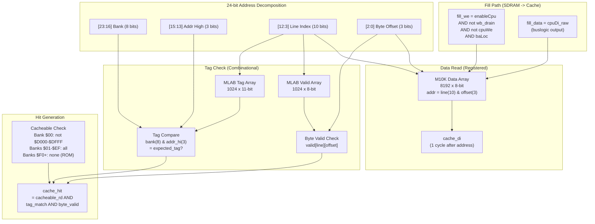

### 2.3 Cache Hit Pipeline (cache_hit_d1)

The cache hit signal goes through a registered pipeline with a 1-cycle suppress after
each hit. This accounts for M10K data read latency: the CPU gets data from the previous
hit while the cache fetches data for the new address.

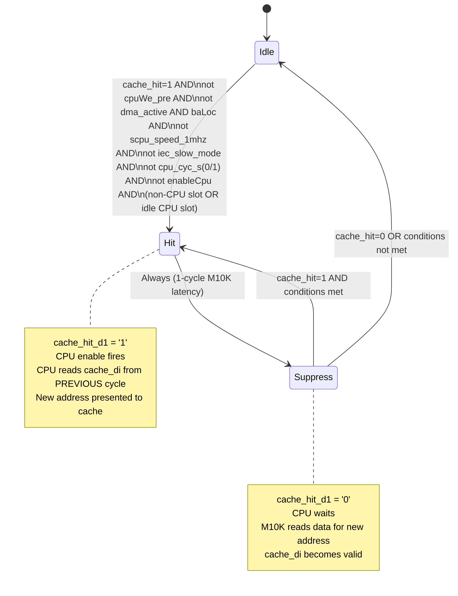

**Write suppression:** `cpuWe_pre = '1'` blocks cache_hit_d1. Writes must go through
the SDRAM path (via cpu_cyc and enableCpu) so that both SDRAM and BRAM receive the data.
Without this gate, writes via cache_hit_d1 go nowhere (no cpu_cyc, no bram_we), causing
lost writes and brown-screen corruption after reset.

### 2.4 32KB BRAM Data Flow

The 32KB dual-port BRAM covers $0000-$7FFF in bank $00. Port A serves the CPU with
write-through and SDRAM/cache fill. Port B provides VIC-II with zero-contention reads.

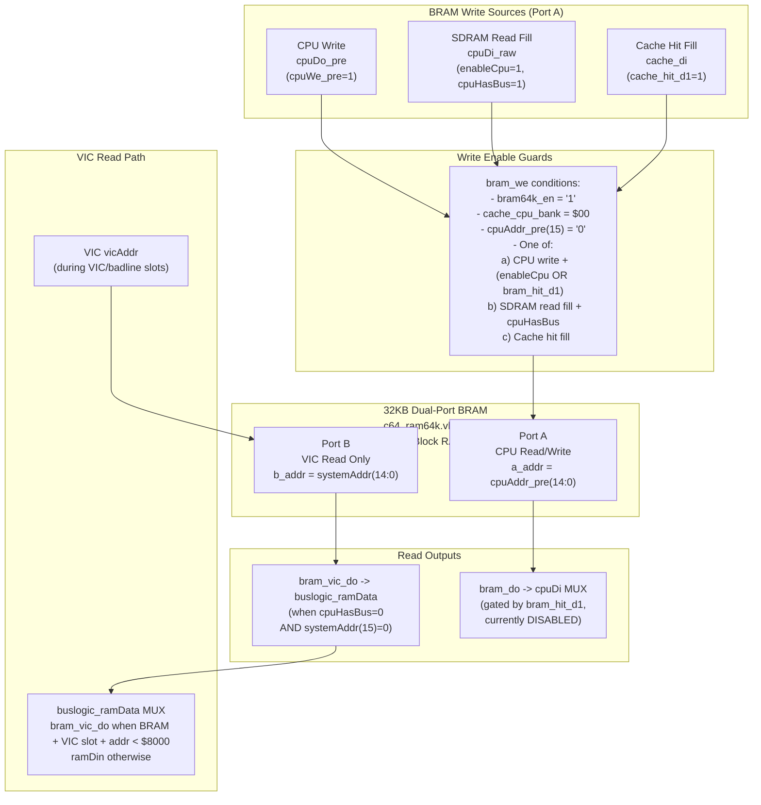

### 2.5 CPU Enable Gating (Combined Paths)

The CPU enable signal combines three possible sources: BRAM hit (disabled), cache hit,
and SDRAM pipeline. The active CPU is determined by the `supercpu_en` OSD setting.

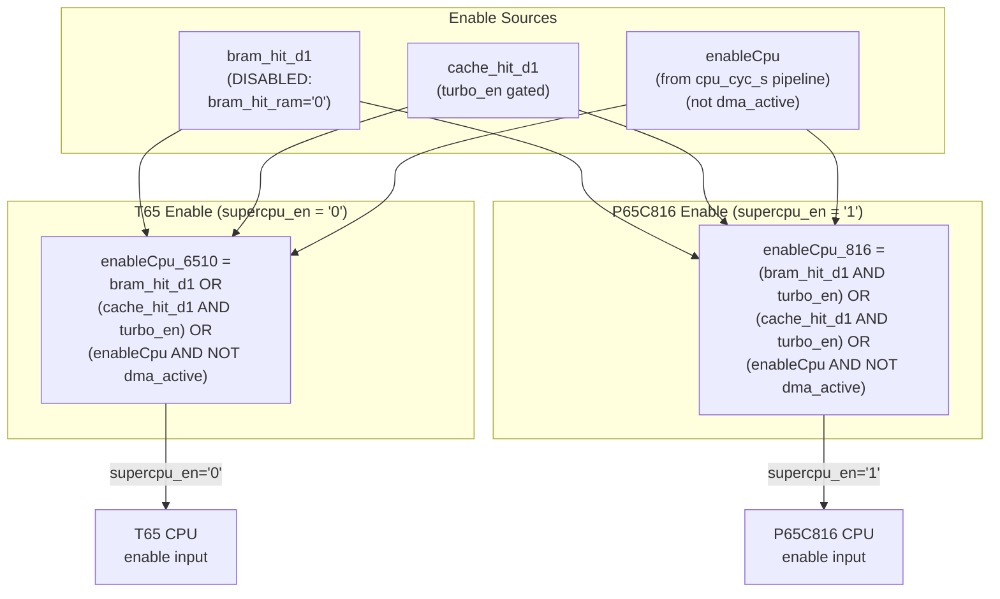

### 2.6 cpuDi Data Priority MUX

The CPU data input is a priority multiplexer. BRAM and cache take precedence over
SDRAM because they are delivering data for cache/BRAM-driven enables.

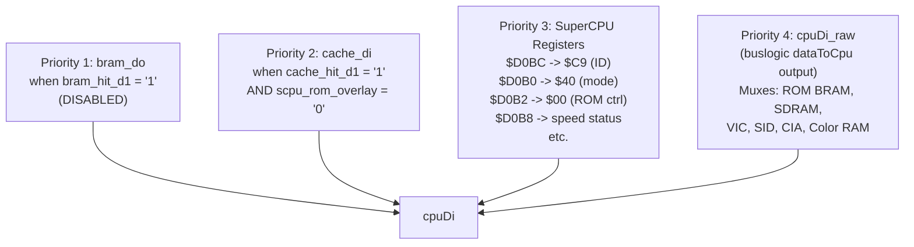

### 2.7 SuperCPU Register Map

SuperCPU control registers are memory-mapped in the VIC-II mirror space ($D07x/$D0Bx),
accessible only in bank $00.

| Address | R/W | Value | Description                                    |
|---------|-----|-------|------------------------------------------------|
| $D074   | W   | -     | Optimization mode: no mirror                   |
| $D075   | W   | -     | Optimization mode: banks $00-$01               |
| $D076   | W   | -     | Optimization mode: banks $00-$7F               |
| $D077   | W   | -     | Optimization mode: no optimization              |
| $D078   | W   | -     | Software cache flush (1024-cycle sweep)         |
| $D07A   | W   | -     | Speed: force 1MHz                              |
| $D07B   | W   | -     | Speed: force 20MHz (turbo)                     |
| $D07E   | W/R | $00   | Register enable / ROM visibility               |
| $D07F   | W   | -     | Register disable                               |
| $D0B0   | R   | $40   | Mode detect: SuperCPU v2 in C64 mode           |
| $D0B2   | R   | $00   | ROM control mirror (SIMM detect requires $00)  |
| $D0B4   | R   | flags | Optimization mode flags                        |
| $D0B8   | R   | flags | Speed status: bit6=1 if 1MHz, 0 if turbo       |
| $D0BC   | R   | $C9   | SuperCPU identification byte                   |

### 2.8 Dual CPU MUX and 65C816 Wrapper

The cpu_65c816.vhd wrapper presents a cpu_6510-compatible interface around the P65C816
core (from the SNES MiSTer core). Both CPUs are always instantiated; the inactive one
is held in reset.

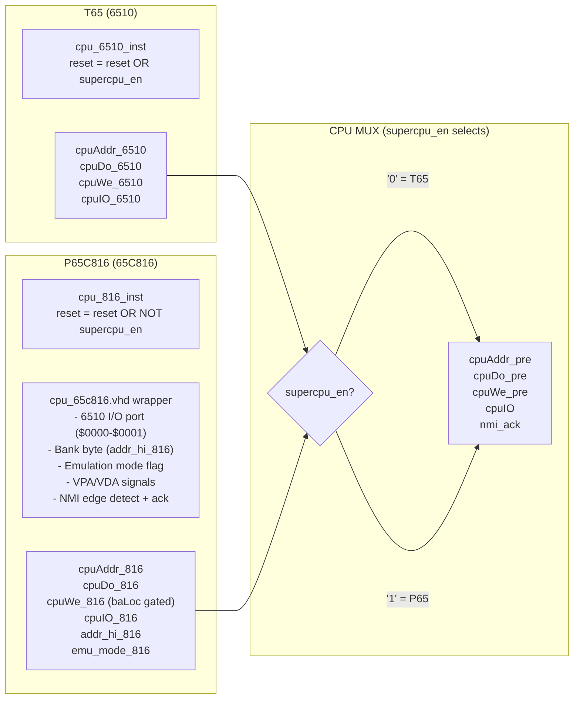

### 2.9 IEC Auto-Slowdown

CIA2 writes to $DD00-$DD03 (IEC serial bus port) trigger a 32ms slowdown timer.
While active, both cache_hit_d1 and turbo_m are suppressed, forcing 1MHz operation.
This prevents IEC timing violations during disk access.

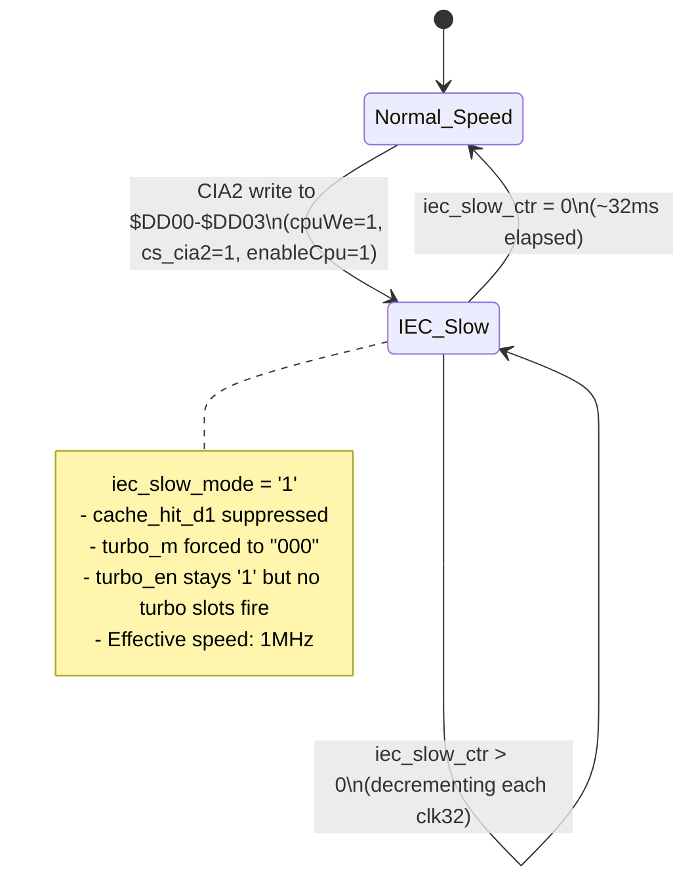

### 2.10 SDRAM Address Routing (c64.sv)

The SDRAM address is multiplexed based on the current bus slot and SuperCPU bank.

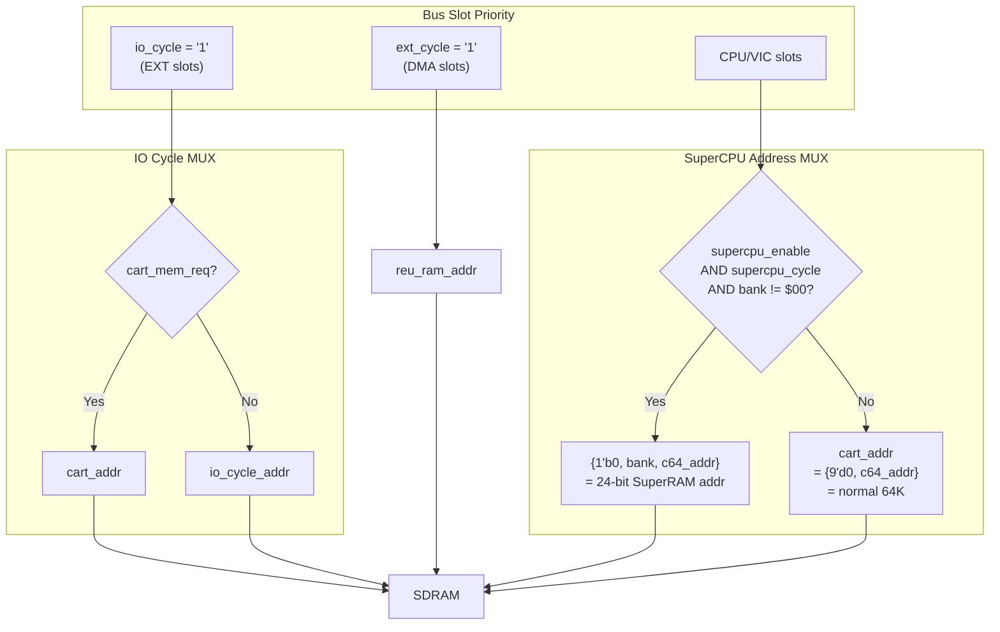

---

## 3. Ultimate 64 SuperCPU (Reference Architecture)

The Ultimate 64 is a commercial FPGA-based C64 replacement board by Gideon Zweijtzer
that includes SuperCPU emulation. This section describes publicly known architectural
characteristics for comparison purposes. The exact internal implementation is proprietary.

### 3.1 High-Level Architecture

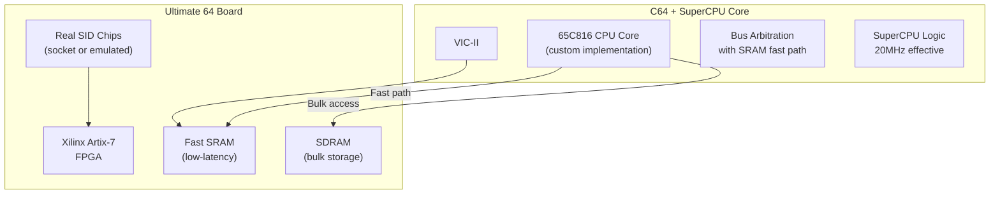

**Key differences from our MiSTer implementation:**

| Aspect               | Ultimate 64                    | MiSTer SuperCPU                       |
|-----------------------|--------------------------------|---------------------------------------|
| FPGA                  | Xilinx Artix-7                 | Intel Cyclone V                       |
| Fast memory           | Dedicated SRAM (ns latency)    | M10K BRAM (cache + 32KB dual-port)    |
| Bulk memory           | SDRAM                          | SDRAM (shared with MiSTer framework)  |
| SID                   | Real chip sockets              | FPGA SID emulation                    |
| Bus acceleration      | SRAM gives near-zero latency   | Cache hit/suppress alternation        |
| 20MHz approach        | SRAM bandwidth                 | Cache + SDRAM slot interleaving       |
| Resource constraints  | Artix-7 has more BRAM          | Cyclone V at 90% M10K utilization     |

---

## 4. Planned Target Architecture

Based on the plan at `plans/vast-enchanting-sutherland.md`, the target is 20MHz effective
CPU speed through wider cache windows, lookahead, and write buffer drain.

### 4.1 Speed Scaling Strategy

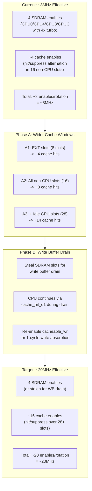

### 4.2 Planned Implementation Phases

| Phase | Description                           | Status          | Expected Speed |
|-------|---------------------------------------|-----------------|----------------|
| D     | IEC auto-slowdown                     | DONE            | Safety net     |
| A1    | Cache fast path (EXT slots)           | DONE            | ~8MHz          |
| A2    | Widen to all non-CPU slots            | DONE            | ~12-16MHz      |
| A3    | + Idle CPU slots                      | DONE            | ~16-20MHz      |
| B     | Write buffer drain                    | Not started     | Write perf     |
| C     | Targeted cache invalidation           | Deferred        | Flush overhead |

### 4.3 Target Cache Hit Window

The plan achieves higher speeds by allowing cache hits in more of the 32-slot rotation.
Currently A1-A3 are implemented: cache hits fire in all non-CPU slots plus idle CPU slots.

```mermaid
gantt
    title Cache Hit Eligibility per Slot (A3 Implemented)
    dateFormat X
    axisFormat %s

    section EXT 0-3
    Cache eligible : 0, 4

    section DMA 0-3
    Cache eligible : 4, 8

    section EXT 4-7
    Cache eligible : 8, 12

    section VIC 0-3
    Cache eligible : 12, 16

    section CPU0
    Cache if cpu_cyc=0 : 16, 17

    section CPU1
    Cache if cpu_cyc=0 : 17, 18

    section CPU2
    Cache if cpu_cyc=0 : 18, 19

    section CPU3
    Cache if cpu_cyc=0 : 19, 20

    section CPU4
    Cache if cpu_cyc=0 : 20, 21

    section CPU5
    Cache if cpu_cyc=0 : 21, 22

    section CPU6
    Cache if cpu_cyc=0 : 22, 23

    section CPU7
    Cache if cpu_cyc=0 : 23, 24

    section CPU8
    Cache if cpu_cyc=0 : 24, 25

    section CPU9
    Cache if cpu_cyc=0 : 25, 26

    section CPUA
    Cache if cpu_cyc=0 : 26, 27

    section CPUB
    Cache if cpu_cyc=0 : 27, 28

    section CPUC
    SDRAM access (always) : crit, 28, 29

    section CPUD
    Pipeline stage 1 : crit, 29, 30

    section CPUE
    Pipeline stage 2 : crit, 30, 31

    section CPUF
    enableCpu fires : crit, 31, 32
```

**Note:** Slots marked "Cache if cpu_cyc=0" only allow cache hits when no SDRAM access
is in progress. During 4x turbo, CPU0/CPU4/CPU8 have cpu_cyc=1, reducing cache-eligible
slots. The 1-cycle suppress after each hit further halves the effective throughput.

### 4.4 Write Buffer Drain Mechanism (Phase B, Not Yet Implemented)

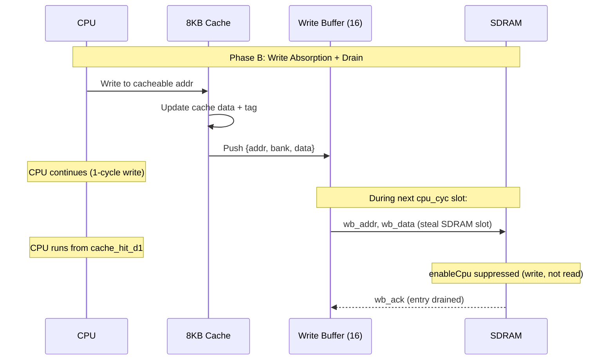

---

## 5. Current Issues and Next Steps

### 5.1 Known Issues

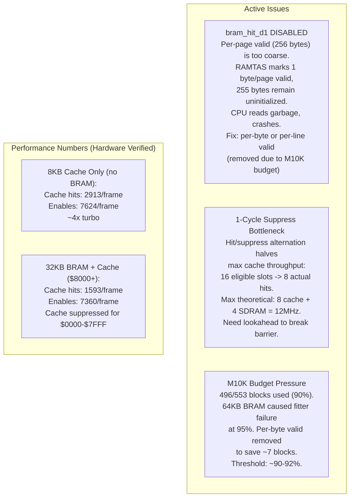

### 5.2 Architecture Decision Tree

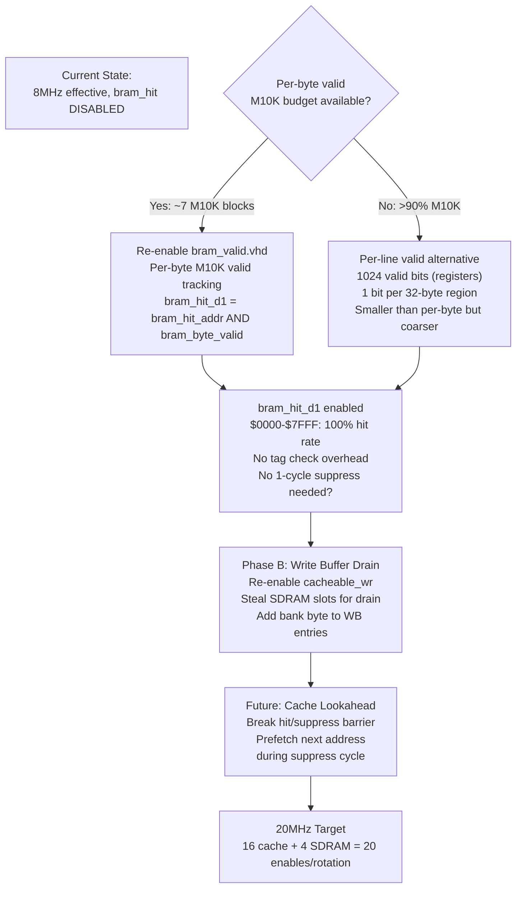

### 5.3 Cache Coherency Model

Multiple data sources must stay coherent: SDRAM, 8KB cache, and 32KB BRAM. The current
coherency rules prevent stale data from being served to the CPU or VIC.

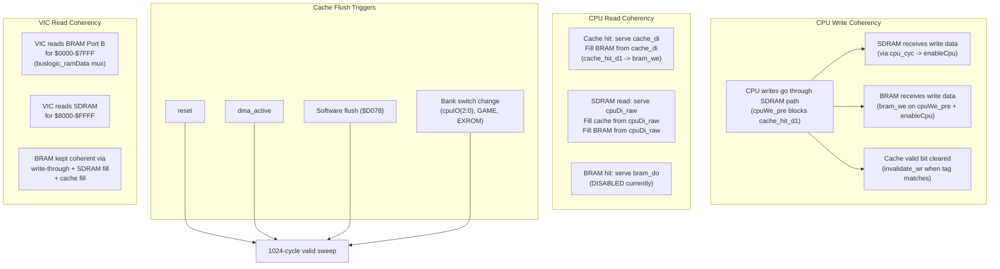

### 5.4 Resource Utilization

| Resource       | Used     | Available | Utilization |
|----------------|----------|-----------|-------------|
| ALMs           | 30,788   | 41,910    | 73%         |
| M10K RAM blocks| 496      | 553       | 90%         |
| Registers      | -        | -         | -           |

**M10K allocation breakdown (approximate):**

| Component              | M10K Blocks | Notes                          |
|------------------------|-------------|--------------------------------|
| 32KB BRAM (c64_ram64k) | ~26         | 32768 x 8 bits                 |
| 8KB Cache data         | ~8          | 8192 x 8 bits                  |
| ROMs (KERNAL, BASIC, etc.) | ~20    | Multiple dprom instances        |
| SuperCPU ROM           | ~64         | 64KB dprom                     |
| SID, VIC, other        | variable    | Framework and peripheral RAM    |
| MiSTer sys/ framework  | ~300+       | Framebuffer, HDMI, HPS bridge   |
