# MiSTer C64 SuperCPU — FPGA Architecture Analysis

## Document Purpose

This document describes the complete FPGA architecture of the MiSTer C64 core with SuperCPU (65C816) extensions, including dual-CPU support, a multi-tier memory hierarchy (SDRAM + 8KB cache + 32KB BRAM), turbo acceleration, and debug infrastructure. It is intended as a comprehensive reference for analysis of the design's current state, bottlenecks, and future optimization opportunities.

**Target FPGA:** Intel Cyclone V 5CSEBA6U23I7 (DE10-Nano / MiSTer platform)
**System Clock:** 32 MHz (derived from 50 MHz input via PLL)
**Current Resource Usage:** 73% ALMs (30,788/41,910), 90% RAM blocks (496/553), 46% DSP blocks

---

## 1. System Overview

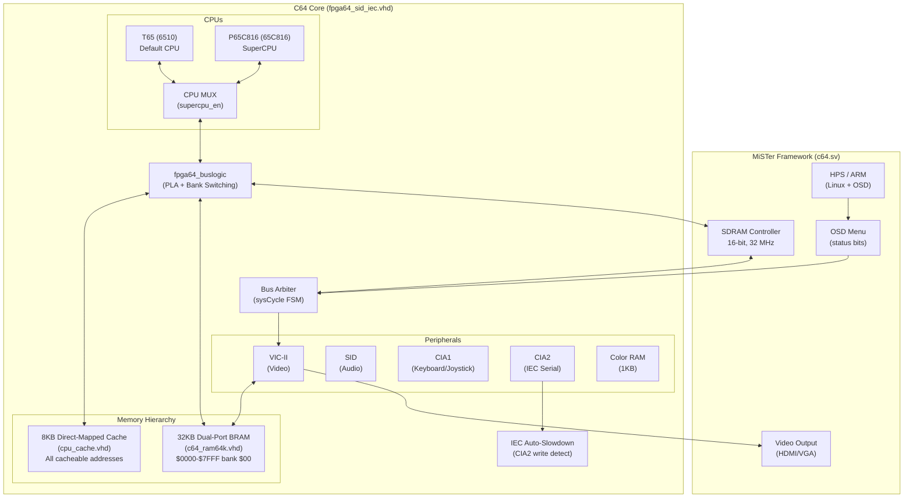
```mermaid
graph TB
    subgraph "MiSTer Framework (c64.sv)"
        HPS["HPS / ARM<br/>(Linux + OSD)"]
        SDRAM["SDRAM Controller<br/>16-bit, 32 MHz"]
        VGA["Video Output<br/>(HDMI/VGA)"]
        OSD["OSD Menu<br/>(status bits)"]
    end

    subgraph "C64 Core (fpga64_sid_iec.vhd)"
        direction TB
        ARBITER["Bus Arbiter<br/>(sysCycle FSM)"]

        subgraph "CPUs"
            T65["T65 (6510)<br/>Default CPU"]
            P65["P65C816 (65C816)<br/>SuperCPU"]
            MUX["CPU MUX<br/>(supercpu_en)"]
        end

        subgraph "Memory Hierarchy"
            BRAM32["32KB Dual-Port BRAM<br/>(c64_ram64k.vhd)<br/>$0000-$7FFF bank $00"]
            CACHE["8KB Direct-Mapped Cache<br/>(cpu_cache.vhd)<br/>All cacheable addresses"]
        end

        subgraph "Peripherals"
            VIC["VIC-II<br/>(Video)"]
            SID["SID<br/>(Audio)"]
            CIA1["CIA1<br/>(Keyboard/Joystick)"]
            CIA2["CIA2<br/>(IEC Serial)"]
            COLOR["Color RAM<br/>(1KB)"]
        end

        BUSLOGIC["fpga64_buslogic<br/>(PLA + Bank Switching)"]
        IEC_SLOW["IEC Auto-Slowdown<br/>(CIA2 write detect)"]
    end

    HPS --> OSD
    OSD --> ARBITER
    SDRAM <--> ARBITER
    ARBITER --> VIC
    VIC --> VGA

    T65 <--> MUX
    P65 <--> MUX
    MUX <--> BUSLOGIC
    BUSLOGIC <--> SDRAM
    BUSLOGIC <--> BRAM32
    BUSLOGIC <--> CACHE

    VIC <--> BRAM32
    CIA2 --> IEC_SLOW
```

---

## 2. Bus Cycle State Machine (32-Slot Rotation)

The system clock runs at 32 MHz. One complete C64 "cycle" (1 MHz) uses 32 clock ticks, divided into 32 named slots. The bus arbiter (`sysCycle`) rotates through these slots, granting SDRAM access to different subsystems.


```mermaid
gantt
    title 32-Slot Bus Cycle Rotation (1 MHz period = 32 clk32 ticks)
    dateFormat X
    axisFormat %s

    section Slot Groups
    EXT0-EXT3 (Extension/Turbo)    :ext1, 0, 4
    DMA0-DMA3 (DMA Engine)         :dma, 4, 8
    EXT4-EXT7 (Extension/Turbo)    :ext2, 8, 12
    VIC0-VIC3 (VIC-II Access)      :vic, 12, 16
    CPU0-CPU3 (CPU/Turbo Slot 1)   :cpu1, 16, 20
    CPU4-CPU7 (CPU/Turbo Slot 2)   :cpu2, 20, 24
    CPU8-CPUB (CPU/Turbo Slot 3)   :cpu3, 24, 28
    CPUC-CPUF (CPU I/O Slot)       :cpuio, 28, 32
```

### Slot Usage Details

| Slots | Count | Purpose | SDRAM Access |
|-------|-------|---------|--------------|
| EXT0-EXT3 | 4 | Framework extension cycles | No CPU/VIC |
| DMA0-DMA3 | 4 | DMA engine (REU, etc.) | DMA reads/writes |
| EXT4-EXT7 | 4 | Framework extension cycles | No CPU/VIC |
| VIC0-VIC3 | 4 | VIC-II graphics fetch | VIC reads character/bitmap data |
| CPU0-CPU3 | 4 | Turbo slot 1 (`turbo_m(0)`) | CPU SDRAM read (if cs_ram & cpuHasBus & baLoc) |
| CPU4-CPU7 | 4 | Turbo slot 2 (`turbo_m(1)`) | CPU SDRAM read (if cs_ram & cpuHasBus & baLoc) |
| CPU8-CPUB | 4 | Turbo slot 3 (`turbo_m(2)`) | CPU SDRAM read (if cs_ram & cpuHasBus & baLoc) |
| CPUC-CPUF | 4 | Standard CPU I/O slot | CPU read/write (I/O or RAM, always fires) |

**Key:** At 1x speed, only CPUC fires. At 4x turbo, CPU0/CPU4/CPU8/CPUC all fire = 4 SDRAM accesses per rotation.

---

## 3. Dual CPU Architecture

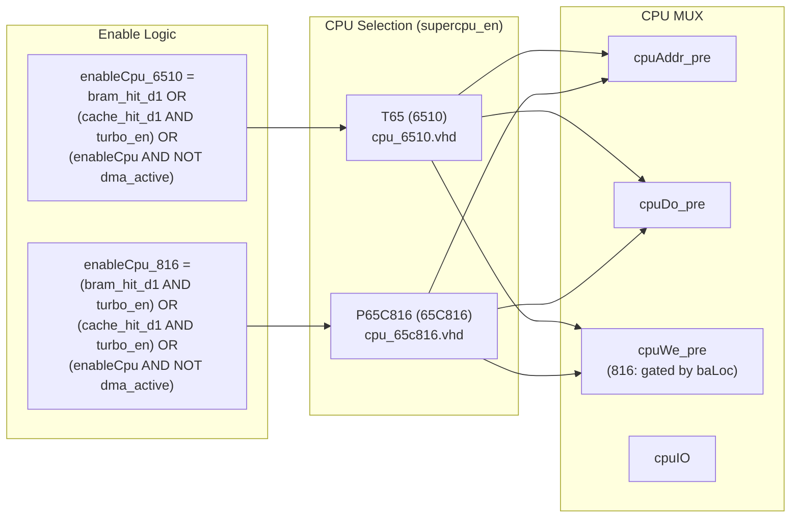
```mermaid
graph LR
    subgraph "CPU Selection (supercpu_en)"
        T65["T65 (6510)<br/>cpu_6510.vhd"]
        P65["P65C816 (65C816)<br/>cpu_65c816.vhd"]
    end

    subgraph "CPU MUX"
        ADDR_MUX["cpuAddr_pre"]
        DATA_MUX["cpuDo_pre"]
        WE_MUX["cpuWe_pre<br/>(816: gated by baLoc)"]
        IO_MUX["cpuIO"]
    end

    subgraph "Enable Logic"
        EN6510["enableCpu_6510 =<br/>bram_hit_d1 OR<br/>(cache_hit_d1 AND turbo_en) OR<br/>(enableCpu AND NOT dma_active)"]
        EN816["enableCpu_816 =<br/>(bram_hit_d1 AND turbo_en) OR<br/>(cache_hit_d1 AND turbo_en) OR<br/>(enableCpu AND NOT dma_active)"]
    end

    T65 --> ADDR_MUX
    T65 --> DATA_MUX
    T65 --> WE_MUX
    P65 --> ADDR_MUX
    P65 --> DATA_MUX
    P65 --> WE_MUX

    EN6510 --> T65
    EN816 --> P65
```

### CPU Data Input Priority (cpuDi mux)

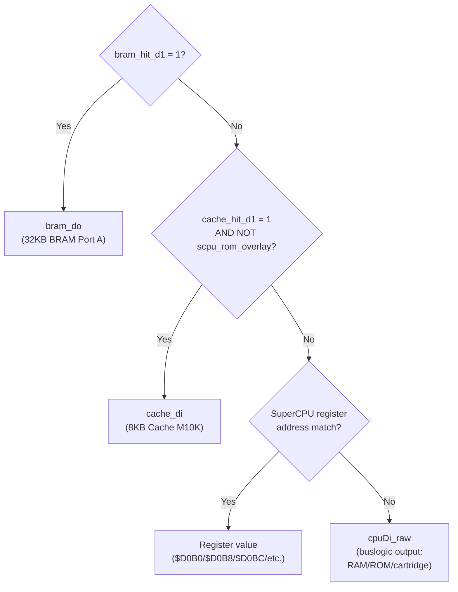
```mermaid
graph TD
    A{"bram_hit_d1 = 1?"} -->|Yes| B["bram_do<br/>(32KB BRAM Port A)"]
    A -->|No| C{"cache_hit_d1 = 1<br/>AND NOT scpu_rom_overlay?"}
    C -->|Yes| D["cache_di<br/>(8KB Cache M10K)"]
    C -->|No| E{"SuperCPU register<br/>address match?"}
    E -->|Yes| F["Register value<br/>($D0B0/$D0B8/$D0BC/etc.)"]
    E -->|No| G["cpuDi_raw<br/>(buslogic output:<br/>RAM/ROM/cartridge)"]
```

---

## 4. Three-Tier Memory Hierarchy

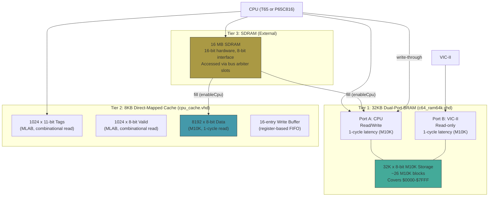
```mermaid
graph TB
    subgraph "Tier 1: 32KB Dual-Port BRAM (c64_ram64k.vhd)"
        BRAM_A["Port A: CPU<br/>Read/Write<br/>1-cycle latency (M10K)"]
        BRAM_B["Port B: VIC-II<br/>Read-only<br/>1-cycle latency (M10K)"]
        BRAM_STORE["32K x 8-bit M10K Storage<br/>~26 M10K blocks<br/>Covers $0000-$7FFF"]
    end

    subgraph "Tier 2: 8KB Direct-Mapped Cache (cpu_cache.vhd)"
        CACHE_TAG["1024 x 11-bit Tags<br/>(MLAB, combinational read)"]
        CACHE_VALID["1024 x 8-bit Valid<br/>(MLAB, combinational read)"]
        CACHE_DATA["8192 x 8-bit Data<br/>(M10K, 1-cycle read)"]
        CACHE_WB["16-entry Write Buffer<br/>(register-based FIFO)"]
    end

    subgraph "Tier 3: SDRAM (External)"
        SDRAM_16MB["16 MB SDRAM<br/>16-bit hardware, 8-bit interface<br/>Accessed via bus arbiter slots"]
    end

    CPU["CPU (T65 or P65C816)"] --> BRAM_A
    CPU --> CACHE_TAG
    CPU --> SDRAM_16MB

    BRAM_A --- BRAM_STORE
    BRAM_B --- BRAM_STORE
    VIC["VIC-II"] --> BRAM_B

    SDRAM_16MB -->|"fill (enableCpu)"| BRAM_A
    SDRAM_16MB -->|"fill (enableCpu)"| CACHE_DATA
    CPU -->|"write-through"| BRAM_A

    style BRAM_STORE fill:#4a9,stroke:#333
    style CACHE_DATA fill:#49a,stroke:#333
    style SDRAM_16MB fill:#a94,stroke:#333
```

### Memory Access Decision Flow

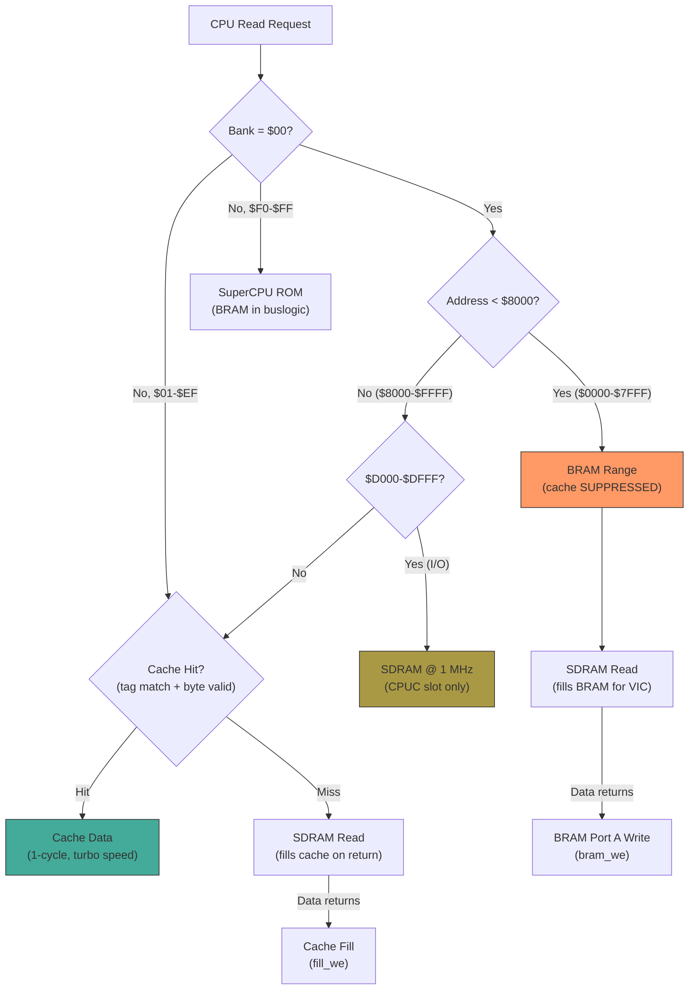
```mermaid
flowchart TD
    START["CPU Read Request"] --> BANK{"Bank = $00?"}

    BANK -->|"Yes"| ADDR{"Address < $8000?"}
    BANK -->|"No, $01-$EF"| CACHE_CHECK{"Cache Hit?<br/>(tag match + byte valid)"}
    BANK -->|"No, $F0-$FF"| ROM["SuperCPU ROM<br/>(BRAM in buslogic)"]

    ADDR -->|"Yes ($0000-$7FFF)"| BRAM_RANGE["BRAM Range<br/>(cache SUPPRESSED)"]
    ADDR -->|"No ($8000-$FFFF)"| IO_CHECK{"$D000-$DFFF?"}

    IO_CHECK -->|"Yes (I/O)"| SDRAM_SLOW["SDRAM @ 1 MHz<br/>(CPUC slot only)"]
    IO_CHECK -->|"No"| CACHE_CHECK

    CACHE_CHECK -->|"Hit"| CACHE_FAST["Cache Data<br/>(1-cycle, turbo speed)"]
    CACHE_CHECK -->|"Miss"| SDRAM_NORM["SDRAM Read<br/>(fills cache on return)"]

    BRAM_RANGE --> SDRAM_FILL["SDRAM Read<br/>(fills BRAM for VIC)"]

    SDRAM_FILL -->|"Data returns"| BRAM_FILL_WRITE["BRAM Port A Write<br/>(bram_we)"]
    SDRAM_NORM -->|"Data returns"| CACHE_FILL["Cache Fill<br/>(fill_we)"]

    style BRAM_RANGE fill:#f96,stroke:#333
    style CACHE_FAST fill:#4a9,stroke:#333
    style SDRAM_SLOW fill:#a94,stroke:#333
```

### Why Cache is Suppressed for $0000-$7FFF

This is the single biggest performance bottleneck. The reason:

1. **VIC reads from BRAM Port B** (zero contention with CPU SDRAM access)
2. **BRAM is filled from SDRAM reads** (`bram_we` triggers on `enableCpu`)
3. **Cache hits bypass SDRAM entirely** (no `enableCpu` fires)
4. If cache serves $0000-$7FFF, BRAM never gets the data, VIC reads stale/garbage

**Impact:** ~45% reduction in cache hits (1593/frame vs 2913/frame with full cache).

**Planned Fix:** Fill BRAM from `cache_di` when `cache_hit_d1` fires, allowing cache for all addresses while keeping BRAM coherent.

---

## 5. 32KB Dual-Port BRAM Detail

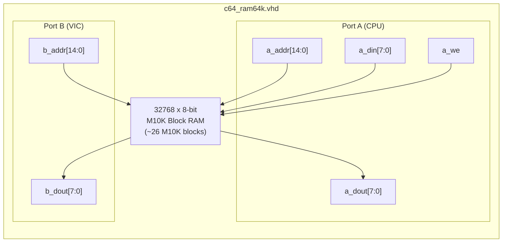
```mermaid
graph LR
    subgraph "c64_ram64k.vhd"
        direction TB
        RAM["32768 x 8-bit<br/>M10K Block RAM<br/>(~26 M10K blocks)"]

        subgraph "Port A (CPU)"
            A_ADDR["a_addr[14:0]"]
            A_DIN["a_din[7:0]"]
            A_DOUT["a_dout[7:0]"]
            A_WE["a_we"]
        end

        subgraph "Port B (VIC)"
            B_ADDR["b_addr[14:0]"]
            B_DOUT["b_dout[7:0]"]
        end
    end

    A_ADDR --> RAM
    A_DIN --> RAM
    RAM --> A_DOUT
    A_WE --> RAM
    B_ADDR --> RAM
    RAM --> B_DOUT
```

### BRAM Write Enable Conditions (`bram_we`)

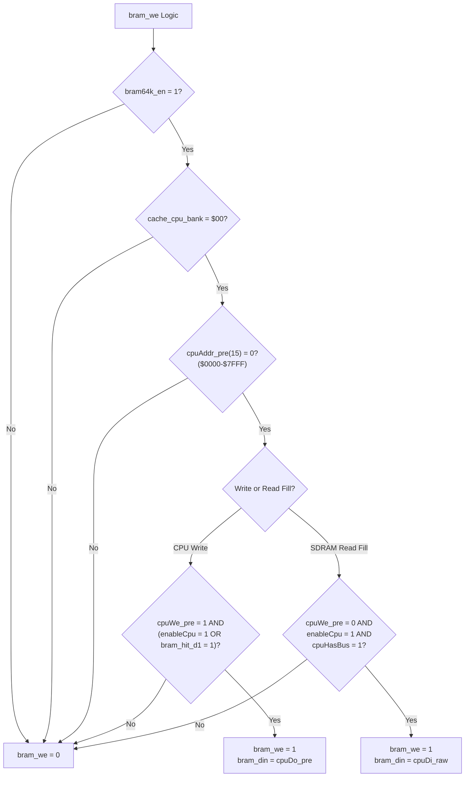
```mermaid
flowchart TD
    START["bram_we Logic"] --> EN{"bram64k_en = 1?"}
    EN -->|No| OFF["bram_we = 0"]
    EN -->|Yes| BANK{"cache_cpu_bank = $00?"}
    BANK -->|No| OFF
    BANK -->|Yes| RANGE{"cpuAddr_pre(15) = 0?<br/>($0000-$7FFF)"}
    RANGE -->|No| OFF
    RANGE -->|Yes| TYPE{"Write or Read Fill?"}

    TYPE -->|"CPU Write"| WR_CHECK{"cpuWe_pre = 1 AND<br/>(enableCpu = 1 OR bram_hit_d1 = 1)?"}
    TYPE -->|"SDRAM Read Fill"| RD_CHECK{"cpuWe_pre = 0 AND<br/>enableCpu = 1 AND<br/>cpuHasBus = 1?"}

    WR_CHECK -->|Yes| ON["bram_we = 1<br/>bram_din = cpuDo_pre"]
    WR_CHECK -->|No| OFF
    RD_CHECK -->|Yes| FILL["bram_we = 1<br/>bram_din = cpuDi_raw"]
    RD_CHECK -->|No| OFF
```

### VIC Data Path (Zero Contention)

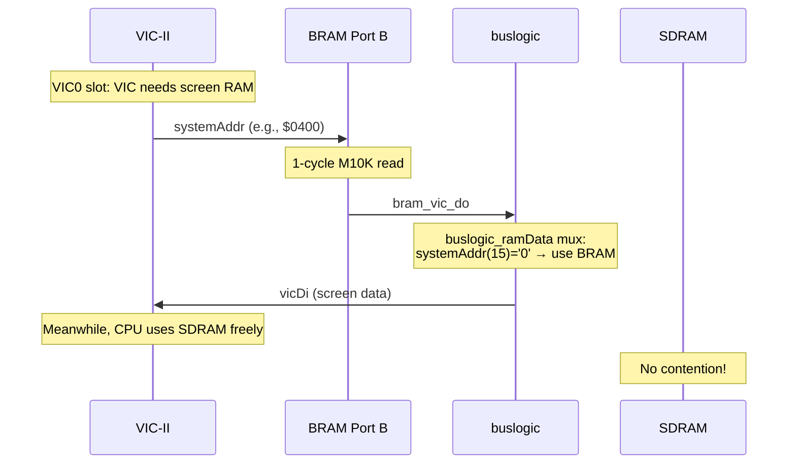
```mermaid
sequenceDiagram
    participant VIC as VIC-II
    participant BRAM_B as BRAM Port B
    participant BUSLOGIC as buslogic
    participant SDRAM as SDRAM

    Note over VIC: VIC0 slot: VIC needs screen RAM
    VIC->>BRAM_B: systemAddr (e.g., $0400)
    Note over BRAM_B: 1-cycle M10K read
    BRAM_B->>BUSLOGIC: bram_vic_do
    Note over BUSLOGIC: buslogic_ramData mux:<br/>systemAddr(15)='0' → use BRAM
    BUSLOGIC->>VIC: vicDi (screen data)

    Note over VIC: Meanwhile, CPU uses SDRAM freely
    Note over SDRAM: No contention!
```

---

## 6. 8KB Cache Architecture

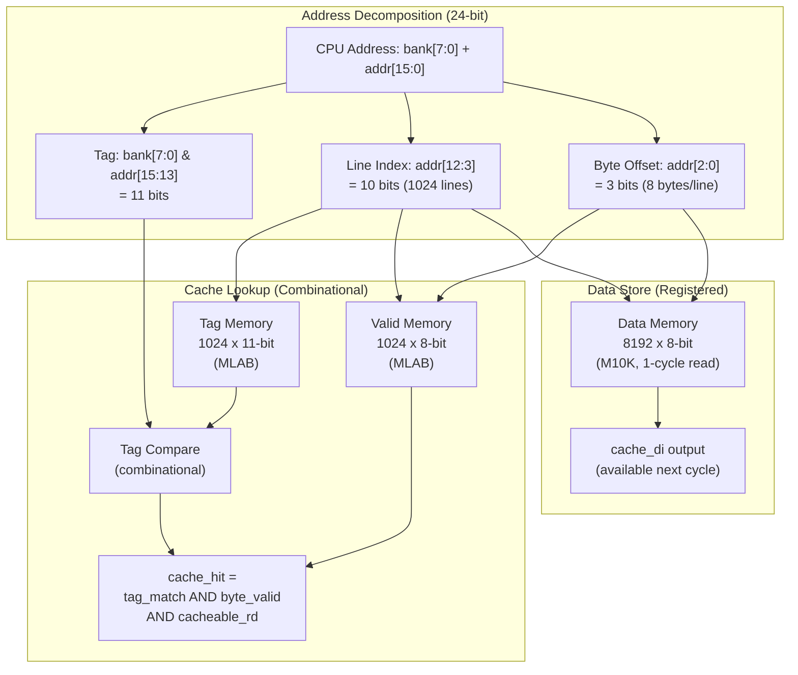
```mermaid
graph TB
    subgraph "Address Decomposition (24-bit)"
        ADDR["CPU Address: bank[7:0] + addr[15:0]"]
        TAG_BITS["Tag: bank[7:0] & addr[15:13]<br/>= 11 bits"]
        LINE_BITS["Line Index: addr[12:3]<br/>= 10 bits (1024 lines)"]
        BYTE_BITS["Byte Offset: addr[2:0]<br/>= 3 bits (8 bytes/line)"]
    end

    subgraph "Cache Lookup (Combinational)"
        TAG_MEM["Tag Memory<br/>1024 x 11-bit<br/>(MLAB)"]
        VALID_MEM["Valid Memory<br/>1024 x 8-bit<br/>(MLAB)"]
        CMP["Tag Compare<br/>(combinational)"]
        HIT["cache_hit =<br/>tag_match AND byte_valid<br/>AND cacheable_rd"]
    end

    subgraph "Data Store (Registered)"
        DATA_MEM["Data Memory<br/>8192 x 8-bit<br/>(M10K, 1-cycle read)"]
        CACHE_DI["cache_di output<br/>(available next cycle)"]
    end

    ADDR --> TAG_BITS
    ADDR --> LINE_BITS
    ADDR --> BYTE_BITS
    TAG_BITS --> CMP
    TAG_MEM --> CMP
    LINE_BITS --> TAG_MEM
    LINE_BITS --> VALID_MEM
    BYTE_BITS --> VALID_MEM
    CMP --> HIT
    VALID_MEM --> HIT
    LINE_BITS --> DATA_MEM
    BYTE_BITS --> DATA_MEM
    DATA_MEM --> CACHE_DI
```

### Cache Coherency Mechanisms

| Trigger | Action | Scope |
|---------|--------|-------|
| CPU write to cacheable address | Clear valid bit for that byte | Single byte |
| Bank register ($0001) change | Full flush (1024 cycles) | Entire cache |
| EXROM/GAME cartridge line change | Full flush (1024 cycles) | Entire cache |
| DMA active | Full flush | Entire cache |
| Software write to $D078 | Full flush | Entire cache |
| Reset | Full flush | Entire cache |

### Cacheability Map

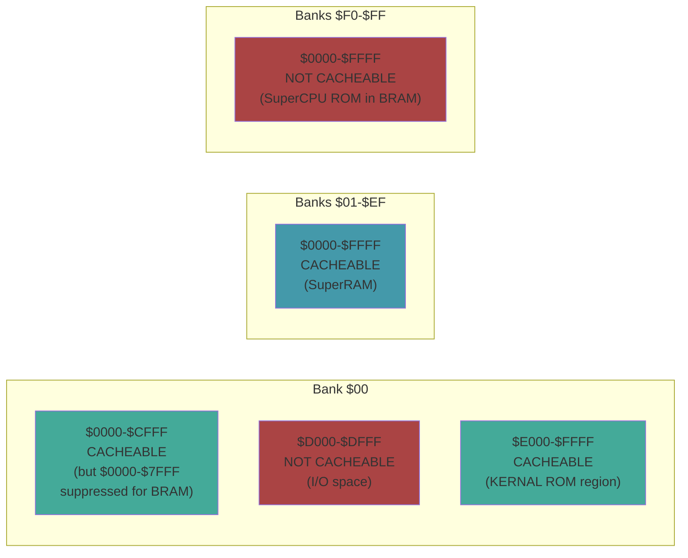
```mermaid
graph LR
    subgraph "Bank $00"
        A["$0000-$CFFF<br/>CACHEABLE<br/>(but $0000-$7FFF<br/>suppressed for BRAM)"]
        B["$D000-$DFFF<br/>NOT CACHEABLE<br/>(I/O space)"]
        C["$E000-$FFFF<br/>CACHEABLE<br/>(KERNAL ROM region)"]
    end

    subgraph "Banks $01-$EF"
        D["$0000-$FFFF<br/>CACHEABLE<br/>(SuperRAM)"]
    end

    subgraph "Banks $F0-$FF"
        E["$0000-$FFFF<br/>NOT CACHEABLE<br/>(SuperCPU ROM in BRAM)"]
    end

    style A fill:#4a9
    style B fill:#a44
    style C fill:#4a9
    style D fill:#49a
    style E fill:#a44
```

---

## 7. CPU Enable Pipeline (SDRAM Path)

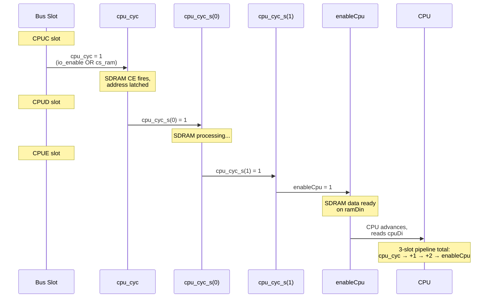
```mermaid
sequenceDiagram
    participant SLOT as Bus Slot
    participant CYC as cpu_cyc
    participant S0 as cpu_cyc_s(0)
    participant S1 as cpu_cyc_s(1)
    participant EN as enableCpu
    participant CPU as CPU

    Note over SLOT: CPUC slot
    SLOT->>CYC: cpu_cyc = 1<br/>(io_enable OR cs_ram)
    Note over CYC: SDRAM CE fires,<br/>address latched

    Note over SLOT: CPUD slot
    CYC->>S0: cpu_cyc_s(0) = 1
    Note over S0: SDRAM processing...

    Note over SLOT: CPUE slot
    S0->>S1: cpu_cyc_s(1) = 1
    S1->>EN: enableCpu = 1
    Note over EN: SDRAM data ready<br/>on ramDin
    EN->>CPU: CPU advances,<br/>reads cpuDi

    Note over CPU: 3-slot pipeline total:<br/>cpu_cyc → +1 → +2 → enableCpu
```

### Cache Hit Pipeline (Parallel Path)

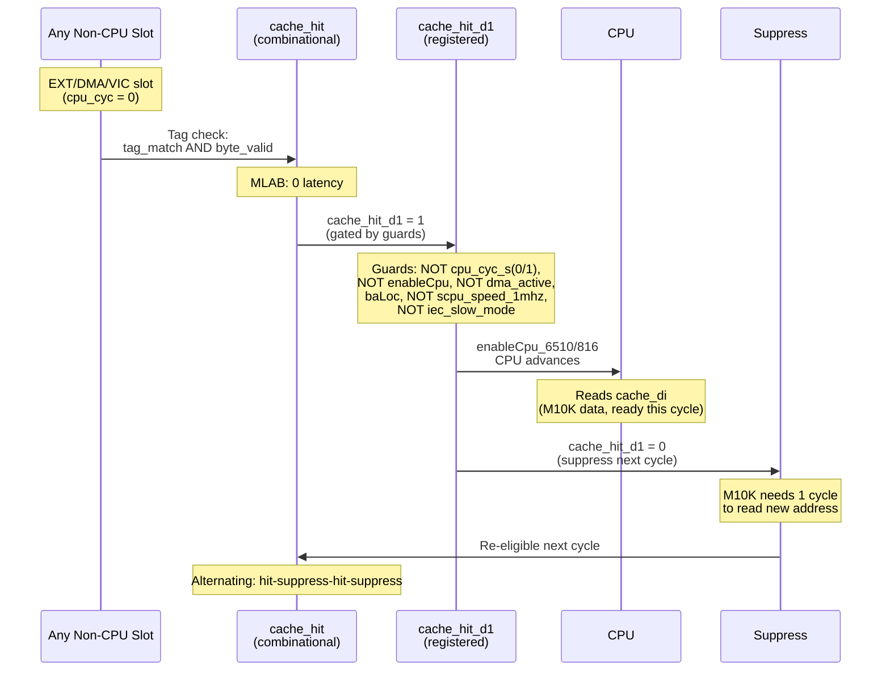
```mermaid
sequenceDiagram
    participant SLOT as Any Non-CPU Slot
    participant CHK as cache_hit<br/>(combinational)
    participant D1 as cache_hit_d1<br/>(registered)
    participant CPU as CPU
    participant SUP as Suppress

    Note over SLOT: EXT/DMA/VIC slot<br/>(cpu_cyc = 0)
    SLOT->>CHK: Tag check:<br/>tag_match AND byte_valid
    Note over CHK: MLAB: 0 latency

    CHK->>D1: cache_hit_d1 = 1<br/>(gated by guards)
    Note over D1: Guards: NOT cpu_cyc_s(0/1),<br/>NOT enableCpu, NOT dma_active,<br/>baLoc, NOT scpu_speed_1mhz,<br/>NOT iec_slow_mode

    D1->>CPU: enableCpu_6510/816<br/>CPU advances
    Note over CPU: Reads cache_di<br/>(M10K data, ready this cycle)

    D1->>SUP: cache_hit_d1 = 0<br/>(suppress next cycle)
    Note over SUP: M10K needs 1 cycle<br/>to read new address

    SUP->>CHK: Re-eligible next cycle
    Note over CHK: Alternating: hit-suppress-hit-suppress
```

---

## 8. Speed Analysis

### Current Throughput Model

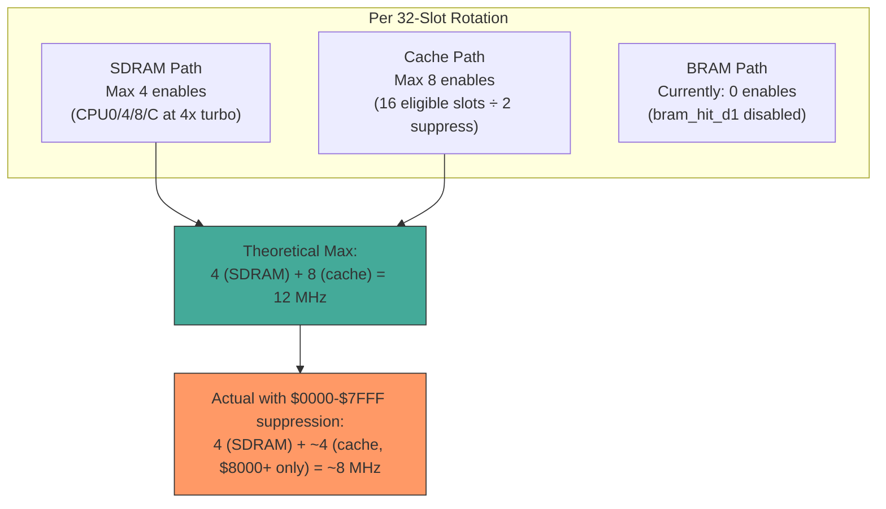
```mermaid
graph TD
    subgraph "Per 32-Slot Rotation"
        SDRAM_SLOTS["SDRAM Path<br/>Max 4 enables<br/>(CPU0/4/8/C at 4x turbo)"]
        CACHE_SLOTS["Cache Path<br/>Max 8 enables<br/>(16 eligible slots ÷ 2 suppress)"]
        BRAM_SLOTS["BRAM Path<br/>Currently: 0 enables<br/>(bram_hit_d1 disabled)"]
    end

    TOTAL["Theoretical Max:<br/>4 (SDRAM) + 8 (cache) = 12 MHz"]
    ACTUAL["Actual with $0000-$7FFF suppression:<br/>4 (SDRAM) + ~4 (cache, $8000+ only) = ~8 MHz"]

    SDRAM_SLOTS --> TOTAL
    CACHE_SLOTS --> TOTAL
    TOTAL --> ACTUAL

    style ACTUAL fill:#f96,stroke:#333
    style TOTAL fill:#4a9,stroke:#333
```

### Bottleneck: 1-Cycle Suppress

The M10K block RAM has a 1-cycle read latency. After each cache hit, the pipeline must suppress for 1 cycle to allow the new address's data to become available. This halves the effective throughput:

| Window | Eligible Slots | After Suppress | Effective Enables |
|--------|---------------|----------------|-------------------|
| Non-CPU slots (EXT+DMA+VIC) | 16 | 16 / 2 | 8 |
| Idle CPU slots (cpu_cyc=0) | 0-12 | 0-6 | 0-6 |
| **Total possible** | **16-28** | **8-14** | **8-14** |
| + SDRAM enables | 1-4 | — | 1-4 |
| **Grand total** | — | — | **9-18 MHz** |

### Performance Counters (Debug Overlay)

The overlay shows per-frame counters (latched at vblank):

```
T:x C:xxxx E:xxxx N:xx
```

| Field | Meaning | Notes |
|-------|---------|-------|
| T | turbo_en (0/1) | OSD turbo active |
| C | Cache/BRAM hit count / 16 | Multiply by 16 for real count |
| E | enableCpu count / 16 | Multiply by 16 for real count |
| N | Frame counter (8-bit) | Freeze detection |

**Measured values (KERNAL idle loop):**
- Cache only (no BRAM suppression): C=0x0B61 (2913/frame), E=0x1DC8 (7624/frame)
- With BRAM + cache suppressed for $0000-$7FFF: C=0x0639 (1593/frame), E=0x1CC0 (7360/frame)
- Cache hit loss from suppression: ~1300 hits/frame (45% reduction)

---

## 9. IEC Auto-Slowdown

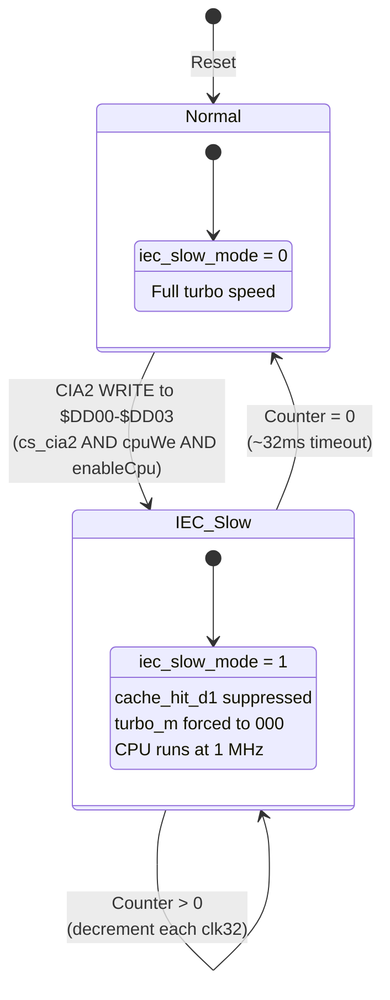
```mermaid
stateDiagram-v2
    [*] --> Normal: Reset
    Normal --> IEC_Slow: CIA2 WRITE to $DD00-$DD03<br/>(cs_cia2 AND cpuWe AND enableCpu)
    IEC_Slow --> IEC_Slow: Counter > 0<br/>(decrement each clk32)
    IEC_Slow --> Normal: Counter = 0<br/>(~32ms timeout)

    state IEC_Slow {
        [*] --> Counting
        Counting: iec_slow_mode = 1
        Counting: cache_hit_d1 suppressed
        Counting: turbo_m forced to 000
        Counting: CPU runs at 1 MHz
    }

    state Normal {
        [*] --> Running
        Running: iec_slow_mode = 0
        Running: Full turbo speed
    }
```

**Design rationale:** The IEC serial bus (1541 disk drive communication) uses bit-banged timing through CIA2 port A ($DD00). At turbo speeds, the timing is wrong and disk operations fail. Only CIA2 **writes** to $DD00-$DD03 trigger the slowdown — reads (like $DD0D interrupt acknowledge at 60 Hz) do not, since their 16.7ms period would keep the timeout permanently active.

---

## 10. SuperCPU Register Map

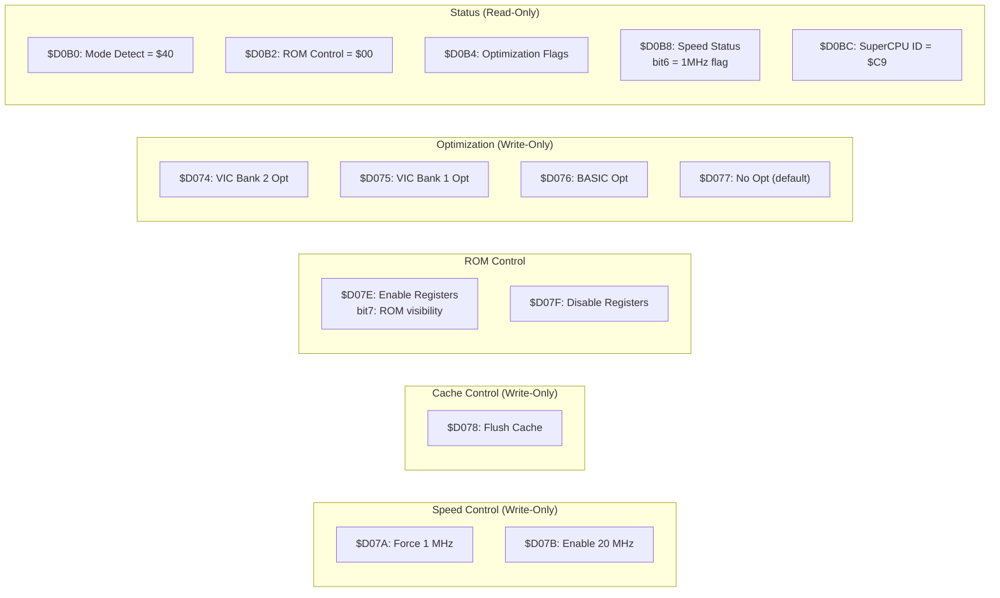
```mermaid
graph LR
    subgraph "Speed Control (Write-Only)"
        D07A["$D07A: Force 1 MHz"]
        D07B["$D07B: Enable 20 MHz"]
    end

    subgraph "Cache Control (Write-Only)"
        D078["$D078: Flush Cache"]
    end

    subgraph "ROM Control"
        D07E["$D07E: Enable Registers<br/>bit7: ROM visibility"]
        D07F["$D07F: Disable Registers"]
    end

    subgraph "Optimization (Write-Only)"
        D074["$D074: VIC Bank 2 Opt"]
        D075["$D075: VIC Bank 1 Opt"]
        D076["$D076: BASIC Opt"]
        D077["$D077: No Opt (default)"]
    end

    subgraph "Status (Read-Only)"
        D0B0["$D0B0: Mode Detect = $40"]
        D0B2["$D0B2: ROM Control = $00"]
        D0B4["$D0B4: Optimization Flags"]
        D0B8["$D0B8: Speed Status<br/>bit6 = 1MHz flag"]
        D0BC["$D0BC: SuperCPU ID = $C9"]
    end
```

---

## 11. FPGA Resource Budget

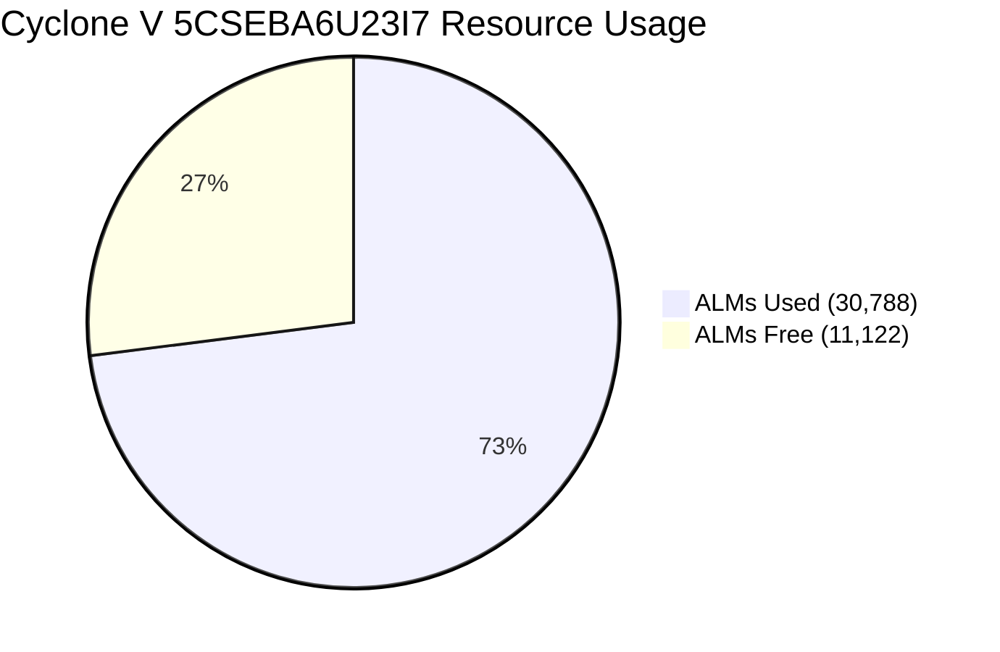
```mermaid
pie title Cyclone V 5CSEBA6U23I7 Resource Usage
    "ALMs Used (30,788)" : 73
    "ALMs Free (11,122)" : 27
```

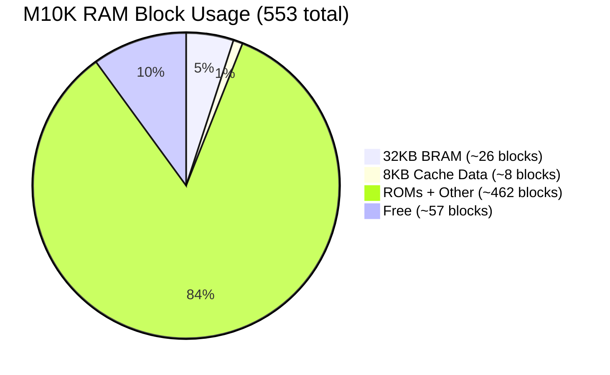
```mermaid
pie title M10K RAM Block Usage (553 total)
    "32KB BRAM (~26 blocks)" : 5
    "8KB Cache Data (~8 blocks)" : 1
    "ROMs + Other (~462 blocks)" : 84
    "Free (~57 blocks)" : 10
```

| Resource | Used | Total | Percentage | Headroom |
|----------|------|-------|------------|----------|
| ALMs | 30,788 | 41,910 | 73% | ~27% (~11K ALMs) |
| Registers | 38,137 | — | — | Adequate |
| Pins | 145 | 314 | 46% | Ample |
| Block Memory | 3,866,912 bits | 5,662,720 bits | 68% | ~32% |
| RAM Blocks | 496 | 553 | 90% | **Critical: ~10%** |
| DSP Blocks | 51 | 112 | 46% | Ample |
| PLLs | 3 | 6 | 50% | 3 remaining |

**Critical constraint:** RAM blocks at 90%. Fitter instability was observed at 95% (64KB BRAM) — M10K placement failed, breaking VIC display. Threshold is approximately 90-92%.

---

## 12. Data Flow Diagrams

### CPU Write Path

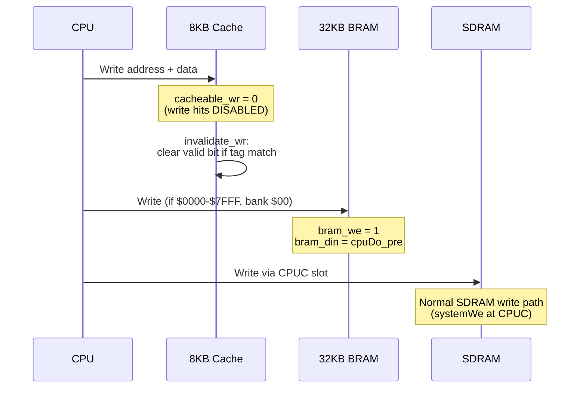
```mermaid
sequenceDiagram
    participant CPU as CPU
    participant CACHE as 8KB Cache
    participant BRAM as 32KB BRAM
    participant SDRAM as SDRAM

    CPU->>CACHE: Write address + data
    Note over CACHE: cacheable_wr = 0<br/>(write hits DISABLED)
    CACHE->>CACHE: invalidate_wr:<br/>clear valid bit if tag match

    CPU->>BRAM: Write (if $0000-$7FFF, bank $00)
    Note over BRAM: bram_we = 1<br/>bram_din = cpuDo_pre

    CPU->>SDRAM: Write via CPUC slot
    Note over SDRAM: Normal SDRAM write path<br/>(systemWe at CPUC)
```

### CPU Read Path (Cache Miss, $8000-$FFFF)

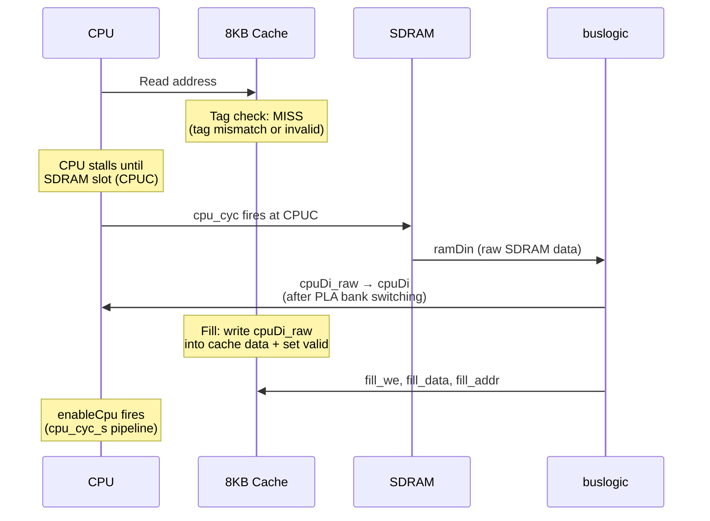
```mermaid
sequenceDiagram
    participant CPU as CPU
    participant CACHE as 8KB Cache
    participant SDRAM as SDRAM
    participant BUSLOGIC as buslogic

    CPU->>CACHE: Read address
    Note over CACHE: Tag check: MISS<br/>(tag mismatch or invalid)

    Note over CPU: CPU stalls until<br/>SDRAM slot (CPUC)

    CPU->>SDRAM: cpu_cyc fires at CPUC
    SDRAM->>BUSLOGIC: ramDin (raw SDRAM data)
    BUSLOGIC->>CPU: cpuDi_raw → cpuDi<br/>(after PLA bank switching)

    Note over CACHE: Fill: write cpuDi_raw<br/>into cache data + set valid
    BUSLOGIC->>CACHE: fill_we, fill_data, fill_addr

    Note over CPU: enableCpu fires<br/>(cpu_cyc_s pipeline)
```

### CPU Read Path (Cache Hit, $8000-$FFFF)

```mermaid
sequenceDiagram
    participant CPU as CPU
    participant CACHE as 8KB Cache

    CPU->>CACHE: Read address
    Note over CACHE: Tag check: HIT<br/>(MLAB combinational, 0 latency)

    Note over CACHE: cache_hit = 1
    Note over CACHE: cache_hit_d1 = 1<br/>(registered, gated by guards)

    CACHE->>CPU: cache_di (M10K data,<br/>1-cycle latency, ready now)
    Note over CPU: enableCpu_6510/816 fires<br/>CPU advances immediately

    Note over CACHE: Next cycle: suppress<br/>(cache_hit_d1 = 0)
    Note over CACHE: Cycle after: eligible again
```

---

## 13. VIC-II Integration

### VIC Data Source Selection

```mermaid
flowchart TD
    VIC_READ["VIC needs data"] --> HAS_BUS{"cpuHasBus?"}

    HAS_BUS -->|"0 (VIC has bus)"| ADDR_CHECK{"systemAddr(15) = 0?<br/>(in $0000-$7FFF)"}
    HAS_BUS -->|"1 (CPU has bus)"| SDRAM_PATH["Use SDRAM (ramDin)"]

    ADDR_CHECK -->|"Yes"| BRAM_EN{"bram64k_en = 1?"}
    ADDR_CHECK -->|"No ($8000+)"| SDRAM_PATH

    BRAM_EN -->|"Yes"| BRAM_PATH["Use BRAM Port B<br/>(bram_vic_do)<br/>ZERO contention"]
    BRAM_EN -->|"No"| SDRAM_PATH

    BRAM_PATH --> BUSLOGIC["buslogic_ramData"]
    SDRAM_PATH --> BUSLOGIC
    BUSLOGIC --> VIC_DI["vicDi output"]
```

### Badline Handling

During VIC badlines (`baLoc = '0'`):
- CPU is halted (no `enableCpu`)
- VIC steals CPU bus cycles for character pointer fetches
- `cpuHasBus = '0` → `systemAddr = vicAddr`
- BRAM fill is suppressed (`cpuHasBus = '1'` guard on `bram_we`)
- Cache fill is suppressed (`baLoc` guard on `cache_fill_we`)
- Turbo slots are suppressed (`baLoc` guard on `cpu_cyc`)

---

## 14. Implementation Phases (Completed)

```mermaid
gantt
    title SuperCPU Implementation Timeline
    dateFormat YYYY-MM-DD

    section Core Infrastructure
    Phase 0-2: OSD + 65C816 + CPU MUX    :done, p0, 2026-03-01, 5d
    Phase 3: Speed Registers ($D07A-$D0BC) :done, p3, 2026-03-06, 1d

    section Cache System
    Phase 4.1: BRAM Cache (read path)      :done, p41, 2026-03-07, 1d
    Phase 4.2: Write-through + Write Buffer :done, p42, 2026-03-07, 1d
    Phase 4.3: T65 Turbo Cache Acceleration :done, p43, 2026-03-08, 1d
    Phase 4.4: SuperRAM Caching ($01-$EF)   :done, p44, 2026-03-08, 1d
    Phase 4.5: Software Cache Flush ($D078)  :done, p45, 2026-03-08, 1d

    section Hardening
    Phase 5: IEC Slowdown + Address Cacheability :done, p5, 2026-03-10, 1d

    section BRAM
    Phase 6: 32KB Dual-Port BRAM (VIC)     :done, p6, 2026-03-12, 1d
```

---

## 15. Known Issues and Future Work

### Active Issues

| Issue | Impact | Root Cause | Status |
|-------|--------|------------|--------|
| Cache suppressed for $0000-$7FFF | ~45% cache hit loss, ~8 MHz max | BRAM not filled during cache hits | Fix designed, not implemented |
| BRAM CPU read path disabled | No BRAM acceleration for CPU reads | Per-page valid too coarse (RAMTAS bug) | Needs per-byte or per-line valid |
| 1-cycle suppress halves throughput | Max 8 cache enables instead of 16 | M10K read latency | Needs lookahead or pipeline redesign |
| Write buffer drain not connected | Writes always go through SDRAM | `cacheable_wr = '0'` | Phase B in plan |

### Planned Optimizations

```mermaid
graph TD
    A["Fix: Fill BRAM from cache_di<br/>during cache_hit_d1"] -->|"Restores"| B["Cache active for ALL addresses<br/>(~2900 hits/frame)"]
    B -->|"Speed"| C["~12 MHz effective"]

    D["Fix: Cache lookahead pipeline<br/>(predict next address)"] -->|"Eliminates"| E["1-cycle suppress penalty"]
    E -->|"Speed"| F["~16-20 MHz effective"]

    G["Fix: Write buffer drain"] -->|"Enables"| H["Single-cycle write absorption"]
    H -->|"Speed"| I["Writes don't stall CPU"]

    style C fill:#4a9
    style F fill:#4a9
    style I fill:#4a9
```

---

## 16. File Map

| File | Language | Purpose | Lines |
|------|----------|---------|-------|
| `C64_MiSTer/rtl/fpga64_sid_iec.vhd` | VHDL | Top-level C64 system: bus arbitration, CPU MUX, cache integration, BRAM integration, turbo logic, IEC slowdown, SuperCPU registers | ~1850 |
| `C64_MiSTer/rtl/cpu_cache.vhd` | VHDL | 8KB direct-mapped cache: tags (MLAB), data (M10K), valid (MLAB), write buffer (registers), flush FSM | ~340 |
| `C64_MiSTer/rtl/c64_ram64k.vhd` | VHDL | 32KB dual-port BRAM: Port A (CPU R/W), Port B (VIC read-only), M10K storage | ~69 |
| `C64_MiSTer/rtl/cpu_6510.vhd` | VHDL | T65-based 6510 CPU wrapper | — |
| `C64_MiSTer/rtl/cpu_65c816.vhd` | VHDL | P65C816-based 65C816 CPU wrapper | — |
| `C64_MiSTer/rtl/fpga64_buslogic.vhd` | VHDL | PLA + bank switching (ROM/RAM/cartridge decode) | — |
| `C64_MiSTer/rtl/debug_overlay.sv` | SystemVerilog | On-screen debug overlay (4 rows of hex data) | — |
| `C64_MiSTer/rtl/debug_uart_tx.sv` | SystemVerilog | UART debug output (115200 baud) | — |
| `C64_MiSTer/c64.sv` | SystemVerilog | MiSTer top-level: SDRAM interface, OSD, HPS bridge, core instantiation | — |
| `C64_MiSTer/C64.qsf` | TCL | Quartus project settings + file list | — |

---

## 17. Glossary

| Term | Definition |
|------|------------|
| **ALM** | Adaptive Logic Module — basic logic unit in Cyclone V FPGA |
| **M10K** | 10-Kbit embedded memory block in Cyclone V (registered read, 1-cycle latency) |
| **MLAB** | Memory LAB — small distributed RAM in Cyclone V (combinational read, 0-cycle latency) |
| **BRAM** | Block RAM — general term for on-chip memory (M10K in this design) |
| **SDRAM** | Synchronous DRAM — external 16 MB memory on MiSTer board |
| **T65** | VHDL 6502/6510 CPU core (original C64 CPU) |
| **P65C816** | VHDL 65C816 CPU core (SuperCPU, adapted from SNES) |
| **SuperRAM** | 65C816 extended memory banks $01-$EF (16 MB address space) |
| **buslogic** | C64 PLA + bank switching: decodes which chip (RAM/ROM/I/O) responds to an address |
| **cpuDi_raw** | Raw data output from buslogic — correct for current bank/ROM/RAM configuration |
| **baLoc** | VIC-II BA (Bus Available) signal — low during badlines when VIC steals CPU cycles |
| **cpuHasBus** | '1' when CPU owns the address bus, '0' when VIC owns it |
| **IEC** | IEC-625 serial bus — connects C64 to 1541 disk drive |
| **OSD** | On-Screen Display — MiSTer menu system for core configuration |

---

## 18. Key Architectural Insights

1. **ROMs live in BRAM, not SDRAM.** KERNAL, BASIC, and character ROMs are stored in on-chip BRAM (inside buslogic). SDRAM only has RAM data. Cache fills from `cpuDi_raw` (buslogic output), so the cache correctly stores whatever the CPU sees — but prefetching ROM regions from SDRAM would return wrong data.

2. **The 32-slot rotation is fixed.** All timing derives from this rotation. Adding CPU speed means using more slots for CPU work, not making slots faster. The theoretical maximum is 32 enables per rotation = 32 MHz, but VIC needs its slots, and the 1-cycle suppress halves cache throughput.

3. **VIC and CPU share SDRAM.** The original design time-multiplexes VIC and CPU SDRAM access. The 32KB BRAM eliminates this contention for $0000-$7FFF by giving VIC its own read port. This is critical because turbo CPU speeds would otherwise starve VIC of SDRAM bandwidth.

4. **Cache fills are opportunistic.** Every SDRAM read that returns data for a cacheable address fills the cache. There is no prefetch. Cache warming happens naturally as the CPU executes code.

5. **Write invalidation, not write-through.** CPU writes to SDRAM invalidate the corresponding cache byte (clear valid bit). The write buffer (`cacheable_wr = '0'`) is disabled because drain logic is incomplete — writes always go through the normal SDRAM path.

6. **The IEC slowdown is safety-critical.** Without it, any disk operation at turbo speed would fail. The 32ms timeout is generous (IEC bit timing is ~1ms per bit) to avoid premature timeout during multi-byte transfers.
