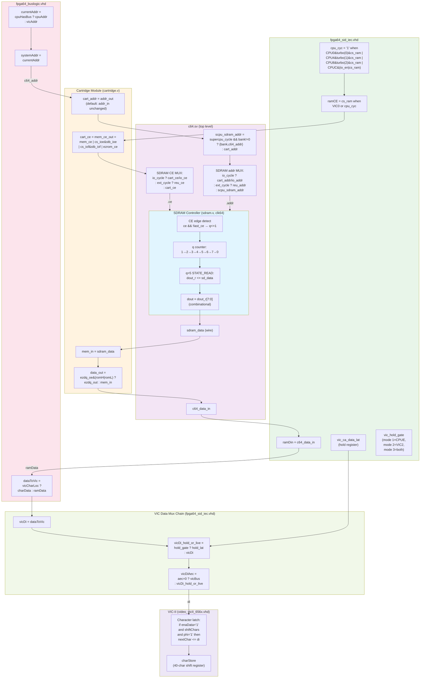

# SDRAM-to-VIC Data Path: Complete Analysis

## Data Flow Diagram



## Timing Diagram

```mermaid
gantt
    title SDRAM Access Timing per 1MHz Period (32 clk32 cycles)
    dateFormat X
    axisFormat %s

    section Cycle Slots
    EXT0-3 (io_cycle)    :ext1, 0, 4
    DMA0-3 (ext_cycle)   :dma, 4, 8
    EXT4-7 (io_cycle*)   :ext2, 8, 12
    VIC0-3               :vic, 12, 16
    CPU0-F               :cpu, 16, 32

    section SDRAM CE
    VIC0 g-access CE     :crit, gce, 12, 13
    CPU0 turbo CE        :t0, 16, 17
    CPU4 turbo CE        :t4, 20, 21
    CPU8 turbo CE        :t8, 24, 25
    CPUC c-access CE     :crit, cce, 28, 29

    section SDRAM Data Valid
    g-access data (VIC0+2.5)  :done, gdata, 14, 16
    CPU0 data (CPU0+2.5)      :cpu0d, 18, 20
    CPU4 data (CPU4+2.5)      :cpu4d, 22, 24
    CPU8 data (CPU8+2.5)      :cpu8d, 26, 28
    c-access data (CPUC+2.5)  :done, cdata, 30, 32

    section VIC Latch Points
    g-access latch (VIC3)   :milestone, glatch, 15, 15
    c-access latch (CPUF)   :milestone, clatch, 31, 31

    section Key Signals
    phi0_cpu HIGH           :active, phi, 16, 32
    enableVic pulse VIC2    :ev1, 14, 15
    enableVic pulse CPUE    :ev2, 30, 31
```



## Timing Details

### SDRAM Controller (sdram.v)
- **Clock**: clk64 (64 MHz)
- **State constants**: STATE_CMD_START=0, STATE_CMD_CONT=2, STATE_READ=5, STATE_LAST=7
- **CE detection**: `ce && !last_ce` at clk64 edges
- **Data latency**: CE fires at clk32 edge → detected at clk64+0.5 → q=5 at +2.5 clk32 total
- **dout_r**: Registered at q=5 (STATE_READ), holds data until next q=5
- **dout**: Combinational from dout_r (no extra register delay)

### VIC Character Latch Timing
- **enaData** = enableVic (from fpga64_sid_iec)
- enableVic fires at **VIC2** and **CPUE** (registered in clk32 process)
- Due to registration, enaData is visible to VIC at **VIC3** and **CPUF**
- **VIC3**: enaData='1', phi='0' → c-access condition FALSE (phi must be '1')
- **CPUF**: enaData='1', phi='1' → c-access condition **TRUE** → VIC latches `di`

### c-access Pipeline (Screen Code Read)
1. **CPUC** (cycle 28): `ramCE` fires, SDRAM reads VIC's c-access address ($0400+)
2. **CPUC+0.5**: CE detected by SDRAM controller at clk64 edge
3. **CPUE.5** (cycle 30.5): `dout_r` updated with screen code data (q=5)
4. **CPUF** (cycle 31): VIC latches `di` = screen code via combinational path
5. **Margin**: 0.5 clk32 (~15.6ns at 32MHz) for combinational propagation

### g-access Pipeline (Bitmap Data Read)
1. **VIC0** (cycle 12): `ramCE` fires, SDRAM reads bitmap/char ROM address
2. **VIC0+0.5**: CE detected
3. **VIC2.5** (cycle 14.5): `dout_r` updated with bitmap data
4. **VIC3** (cycle 15): VIC latches g-access data (separate process, phi='0')
5. **Margin**: 0.5 clk32

## Key Finding: Data Path is IDENTICAL Between CPU Modes

During badline c-access:

| Signal | T65 Mode | SuperCPU Mode | During Badline |
|--------|----------|---------------|----------------|
| cpuHasBus | 0 | 0 | VIC owns bus |
| systemAddr | vicAddr | vicAddr | VIC c-access addr |
| c64_addr | systemAddr | systemAddr | VIC c-access addr |
| cart_addr | addr_in | addr_in | VIC addr (no transform) |
| SDRAM addr | cart_addr | cart_addr | Same |
| sdram_data | screen code | screen code | Same |
| cart data_out | mem_in (passthrough) | mem_in (passthrough) | Same |
| ramDin → vicDi | sdram_data | sdram_data | Same |
| vicDiAec → VIC.di | sdram_data | sdram_data | Same |

**The combinational data path from SDRAM to VIC is byte-for-byte identical regardless of CPU mode.**

## What IS Different in SuperCPU Mode

### 1. Turbo SDRAM Accesses
With turbo_m set (SuperCPU fast mode), cpu_cyc fires at CPU0/CPU4/CPU8 in addition to CPUC:
- During **badlines**: cpuHasBus='0', so these read vicAddr (redundant VIC reads)
- During **normal lines**: cpuHasBus='1', so these read CPU's address (instruction/data fetches)
- **Impact**: Extra SDRAM accesses with only 0.5 clk32 gap between consecutive q cycles

### 2. P65C816 Phantom Bus Cycles (VDA=0, VPA=0)
During indirect addressing (`LDA ($04),Y`), P65C816 generates phantom bus cycles with arbitrary addresses. These fire SDRAM CE at CPU turbo slots during non-badline periods. The turbo SDRAM reads return garbage data to dout_r, but:
- On **non-badlines**: VIC reads charStore (cached), not live di → no impact
- On **badlines**: CPU is halted, systemAddr = vicAddr → phantom addresses not on bus

### 3. RDY Signal
Both CPUs properly implement RDY:
- T65: `Rdy => rdy` (cpu_6510.vhd:64)
- P65C816: `RDY_IN => rdy` (cpu_65c816.vhd:79)
- rdy = baLoc from VIC-II (fpga64_sid_iec.vhd:969,991)
- **No difference in halt behavior during badlines**

### 4. WE Signal During Halt
- T65: `really_rdy <= Rdy or not(WRn_i)` — halts only during reads (correct 6502 behavior)
- P65C816: `EN <= RDY_IN and CE and ...` — halts during reads AND writes
- Both output WE='1' (read) when halted during a read cycle
- **cpuWe behavior identical for badline c-access purposes**

## Existing Hold Register: Bug Analysis

### Code Location
`fpga64_sid_iec.vhd` lines 670-688, 1132-1258

### Bug 1: Wrong Injection Cycle
```vhdl
-- Current injection modes (lines 675-684):
--   Mode 1: inject at CPUE
--   Mode 2: inject at VIC2
--   Mode 3: inject at CPUE and VIC2
-- PROBLEM: VIC latches c-access at CPUF, not CPUE or VIC2!
```

### Bug 2: Diagnostic Counter Never Fires
```vhdl
-- At CPUE (line 1194-1208): checks vic_ca_data_valid
-- But vic_ca_data_valid is set at CPUF (line 1187)
-- At CPUE, vic_ca_data_valid is still '0' from VIC2 clear (line 1241)
-- → Mismatch counter NEVER increments
-- → H15 result "mismatch counter = $00" was MEANINGLESS
```

### Bug 3: Capture Timing vs VIC Latch Race
```
-- Capture at CPUF: vic_ca_data_lat <= vicDi (line 1186)
-- VIC latch at CPUF: nextChar <= di (video_vicII_656x.vhd:504)
-- SAME clock edge! VIC sees LIVE data, not held data.
-- Hold register is captured but never used at the right time.
```

## Cartridge CE Sources
```verilog
// cartridge.v line 810:
assign mem_ce_out = mem_ce            // Normal RAM/VIC CE (from ramCE)
                  | (cs_ioe & stb_ioe)  // I/O Expansion $DE00 strobe
                  | (cs_iof & stb_iof)  // I/O Expansion $DF00 strobe
                  | ezrom_ce;           // EasyFlash ROM CE
```
During c-access, systemAddr=$0400+, so cs_ioe/cs_iof/ezrom_ce are inactive.
**No additional CE from cartridge during c-access.**

## io_cycle / ext_cycle Isolation
- `io_cycle`: EXT0-EXT3 (always) + EXT4-EXT7 (when rfsh_cycle≠"00")
- `ext_cycle`: DMA0-DMA3
- **No overlap with VIC0-VIC3 or CPU0-CPUF**
- cart_mem_req only fires during EasyFlash programming (not normal execution)
- **io_cycle SDRAM accesses cannot interfere with VIC timing**

## Unsolved Mystery

Despite identical data paths and timing, SuperCPU mode shows @ artifacts (char code $00)
while T65 mode is clean. Possible remaining explanations:

1. **Tight SDRAM timing with turbo**: With turbo_m="111", five consecutive SDRAM accesses
   per period (VIC0, CPU0, CPU4, CPU8, CPUC) with only 0.5 clk32 gaps. Any timing
   deviation could cause q-counter overlap or dout_r corruption.

2. **Cross-clock-domain metastability**: The 0.5 clk32 margin between dout_r update
   (CPUE.5 at clk64) and VIC latch (CPUF at clk32) might be insufficient for
   combinational propagation through 6 mux levels (dout → sdram_data → cart_data_out
   → c64_data_in → ramDin → dataToVic → vicDi → vicDi_hold_or_live → vicDiAec → VIC.di).

3. **SDRAM bank/row conflict**: Consecutive reads to different SDRAM regions (ZP $00xx,
   screen $04xx, cart $E0xx+offset) may cause bank conflicts that extend access latency
   beyond the assumed q=5 timing.

## Recommended Fix Approaches

### Approach A: Disable Turbo Slots During Badlines
```vhdl
-- Gate turbo cpu_cyc with cpuHasBus:
cpu_cyc <= '1' when
    (sysCycle = CYCLE_CPU0 and turbo_m(0) = '1' and cs_ram = '1' and cpuHasBus = '1') or
    (sysCycle = CYCLE_CPU4 and turbo_m(1) = '1' and cs_ram = '1' and cpuHasBus = '1') or
    (sysCycle = CYCLE_CPU8 and turbo_m(2) = '1' and cs_ram = '1' and cpuHasBus = '1') or
    (sysCycle = CYCLE_CPUC and (io_enable = '1' or cs_ram = '1')) else '0';
```
**Pro**: Simple, CPU is halted during badlines anyway (turbo wasted)
**Con**: Doesn't explain T65+turbo working (if it does)

### Approach B: Fire c-access CE Earlier (CPU8 instead of CPUC)
Fire a dedicated VIC c-access CE at CPU8, giving data 5.5 clk32 margin to CPUF.
Capture into hold register at CPUC (when data is stable), present to VIC at CPUF.
**Pro**: Eliminates timing margin issue entirely
**Con**: Complex, requires dedicated c-access CE logic separate from cpu_cyc

### Approach C: Add VIC Data Hold in SDRAM Controller
Add a second output register in sdram.v that only updates during VIC-flagged accesses.
**Pro**: Completely isolated from CPU access clobbering
**Con**: Requires modifying sdram.v (adds complexity to shared module)

### Approach D: Fix Existing Hold Register
Capture at CPUF, present to VIC one period later (via charStore pipeline).
Actually: VIC stores screen codes in charStore, which is a shift register.
The screen code from period N is used for g-access in period N+1.
If we inject the held data into vicDi at the NEXT period's CPUF...
**Problem**: Creates one-character delay/shift.
